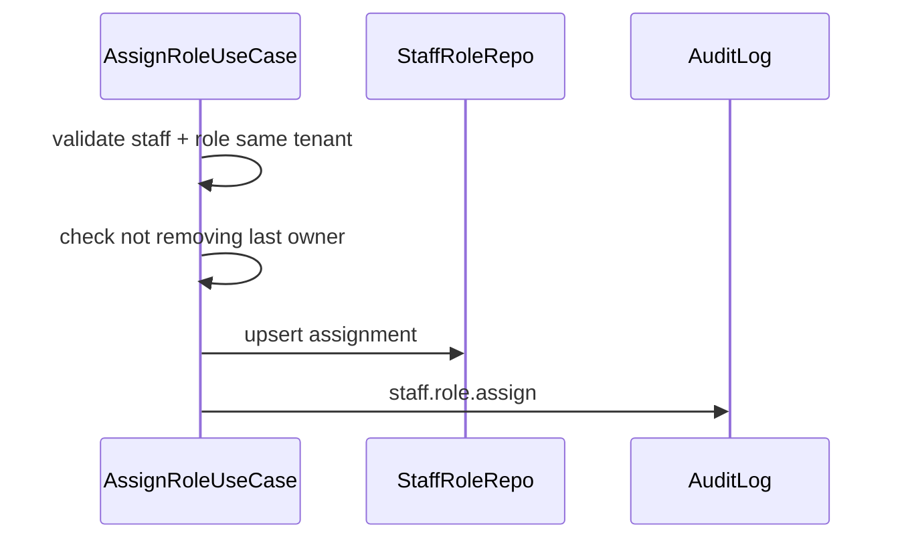

# TASK-092: Use Case — Assign Role to Staff

## Metadata

| فیلد | مقدار |
|------|--------|
| Phase | 1 |
| Epic | Epic-08-Core-Admin |
| ID | TASK-092 |
| Priority | P0 |
| Depends on | TASK-090, TASK-091 |
| Blocks | TASK-096, TASK-097 |
| Estimated | 5h |

---

## هدف

`AssignRoleToStaffUseCase` و `RemoveRoleFromStaffUseCase` — مدیریت junction Staff↔Role. نمی‌توان آخرین owner را demote. Audit `staff.role.assign` / `staff.role.remove`.

---

## معیار پذیرش

- [ ] `POST` assign — idempotent if already assigned
- [ ] `DELETE` remove role from staff
- [ ] Cannot remove last owner role from last owner → 409 `STAFF_LAST_OWNER`
- [ ] Permission: `core.staff.update` (or `core.role.update`)
- [ ] Audit both operations

---

## API (wired in TASK-096/097)

### Assign

```
POST /api/v1/staff/:staffId/roles
Permission: core.staff.update
```

**Request:**

```json
{ "roleId": "uuid" }
```

**Response 201:**

```json
{
  "data": {
    "staffId": "uuid",
    "roleId": "uuid",
    "role": { "code": "cashier", "name": "صندوقدار" },
    "assignedAt": "2025-01-15T10:00:00.000Z"
  }
}
```

### Remove

```
DELETE /api/v1/staff/:staffId/roles/:roleId
Permission: core.staff.update
```

**Response 200:** `{ "removed": true }`

---

## Error Codes

| سناریو | HTTP | Code |
|--------|------|------|
| Staff not found | 404 | `STAFF_NOT_FOUND` |
| Role not found | 404 | `ROLE_NOT_FOUND` |
| Remove last owner | 409 | `STAFF_LAST_OWNER` |
| Cross-tenant | 404 | `STAFF_NOT_FOUND` |

---

## Flow



---

## فایل‌ها

| عمل | مسیر |
|-----|------|
| Create | `packages/application/src/staff/assign-role-to-staff.use-case.ts` |
| Create | `packages/application/src/staff/remove-role-from-staff.use-case.ts` |
| Create | `packages/application/src/staff/assign-role.spec.ts` |

---

## مراحل پیاده‌سازی

1. Load staff + role with tenantId check
2. Assign: create StaffRole if not exists
3. Remove: count owners before removing owner role
4. Audit
5. Tests

---

## Edge Cases & Errors

| سناریو | HTTP / Code | رفتار |
|--------|-------------|--------|
| Duplicate assign | 200/201 | idempotent |
| Assign system role | 200 | allowed |
| Remove non-assigned role | 404 | not found |

---

## تست

- [ ] Unit: last owner guard
- [ ] Integration: assign → staff.roles includes role
- [ ] Integration: remove role

---

## Policy Alignment

- [ ] ADR-004
- [ ] Audit staff.role.*

---

## مراجع

- `docs/02-architecture/rbac.md`
- `docs/09-development/ERROR-CODES.md`

---

## Self-Review Score

| محور | سقف | امتیاز |
|------|-----|--------|
| Metadata | 10 | 10 |
| Completeness | 25 | 25 |
| Policy | 25 | 25 |
| Executability | 25 | 25 |
| Alignment | 15 | 15 |
| **جمع** | **100** | **100** |
