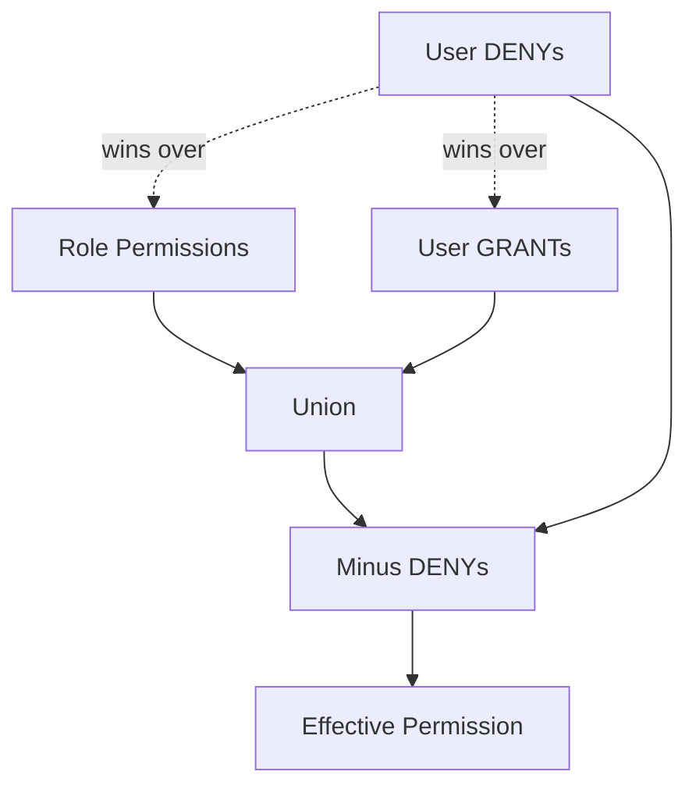

# TASK-093: Use Case — Permission Override

## Metadata

| فیلد | مقدار |
|------|--------|
| Phase | 1 |
| Epic | Epic-08-Core-Admin |
| ID | TASK-093 |
| Priority | P0 |
| Depends on | TASK-034, TASK-090, TASK-047 |
| Blocks | TASK-097 |
| Estimated | 6h |

---

## هدف

`CreatePermissionOverrideUseCase`, `ListPermissionOverridesUseCase`, `DeletePermissionOverrideUseCase` — استثنا روی staff. Precedence: **DENY > GRANT**. فیلد `reason` **اجباری**. Audit هر تغییر.

---

## معیار پذیرش

- [ ] `effect`: `grant` | `deny`
- [ ] `reason` required min 5 chars
- [ ] Optional `expiresAt` for temporary access
- [ ] Duplicate override same permission → 409 `OVERRIDE_ALREADY_EXISTS`
- [ ] Delete override → audit `permission.override.remove`
- [ ] Owner-only or `core.staff.update` + elevated policy
- [ ] Effective permission recalculated: `(Role ∪ GRANT) − DENY`

---

## API (wired in TASK-097)

### Create Override

```
POST /api/v1/staff/:staffId/permission-overrides
Permission: core.staff.update (owner)
```

**Request:**

```json
{
  "permission": "installments.sale.cancel",
  "effect": "grant",
  "reason": "جایگزین موقت مدیر در مرخصی",
  "expiresAt": "2025-02-01T00:00:00.000Z"
}
```

**Response 201:**

```json
{
  "data": {
    "id": "uuid",
    "staffId": "uuid",
    "permission": "installments.sale.cancel",
    "effect": "grant",
    "reason": "جایگزین موقت مدیر در مرخصی",
    "expiresAt": "2025-02-01T00:00:00.000Z",
    "createdById": "uuid",
    "createdAt": "2025-01-15T10:00:00.000Z"
  }
}
```

### List

```
GET /api/v1/staff/:staffId/permission-overrides
```

### Delete

```
DELETE /api/v1/staff/:staffId/permission-overrides/:overrideId
```

---

## Precedence Diagram



---

## Error Codes

| سناریو | HTTP | Code |
|--------|------|------|
| Permission not found | 404 | `PERMISSION_NOT_FOUND` |
| Duplicate override | 409 | `OVERRIDE_ALREADY_EXISTS` |
| Missing reason | 400 | `FIELD_REQUIRED` |
| Staff not found | 404 | `STAFF_NOT_FOUND` |
| Override on self DENY owner | 409 | `DELETE_FORBIDDEN` |

**Audit actions:** `permission.override.create`, `permission.override.remove`

---

## فایل‌ها

| عمل | مسیر |
|-----|------|
| Create | `packages/application/src/staff/create-permission-override.use-case.ts` |
| Create | `packages/application/src/staff/list-permission-overrides.use-case.ts` |
| Create | `packages/application/src/staff/delete-permission-override.use-case.ts` |
| Create | `packages/application/src/staff/permission-override.spec.ts` |
| Update | `packages/domain/core/rbac/effective-permissions.ts` |

---

## مراحل پیاده‌سازی

1. Validate permission exists in registry
2. Require reason field
3. Store override with createdById
4. Update effective permission calculator to apply DENY > GRANT
5. Expired overrides ignored at runtime
6. Audit + tests including precedence unit tests

---

## Edge Cases & Errors

| سناریو | HTTP / Code | رفتار |
|--------|-------------|--------|
| DENY overrides role GRANT | — | effective = denied |
| GRANT adds permission not in role | — | effective = granted |
| Expired override | — | ignored |
| Override on owner | 403 | PERMISSION_DENIED optional guard |

---

## تست

- [ ] Unit: DENY beats GRANT
- [ ] Unit: DENY beats role permission
- [ ] Unit: expired override ignored
- [ ] Integration: create override → permission check passes/fails
- [ ] Integration: audit logged

---

## Policy Alignment

- [ ] rbac.md precedence
- [ ] ADR-004
- [ ] Audit mandatory

---

## مراجع

- `docs/02-architecture/rbac.md` — User Permission Override
- `docs/09-development/ERROR-CODES.md`

---

## Self-Review Score

| محور | سقف | امتیاز |
|------|-----|--------|
| Metadata | 10 | 10 |
| Completeness | 25 | 25 |
| Policy | 25 | 25 |
| Executability | 25 | 25 |
| Alignment | 15 | 15 |
| **جمع** | **100** | **100** |
