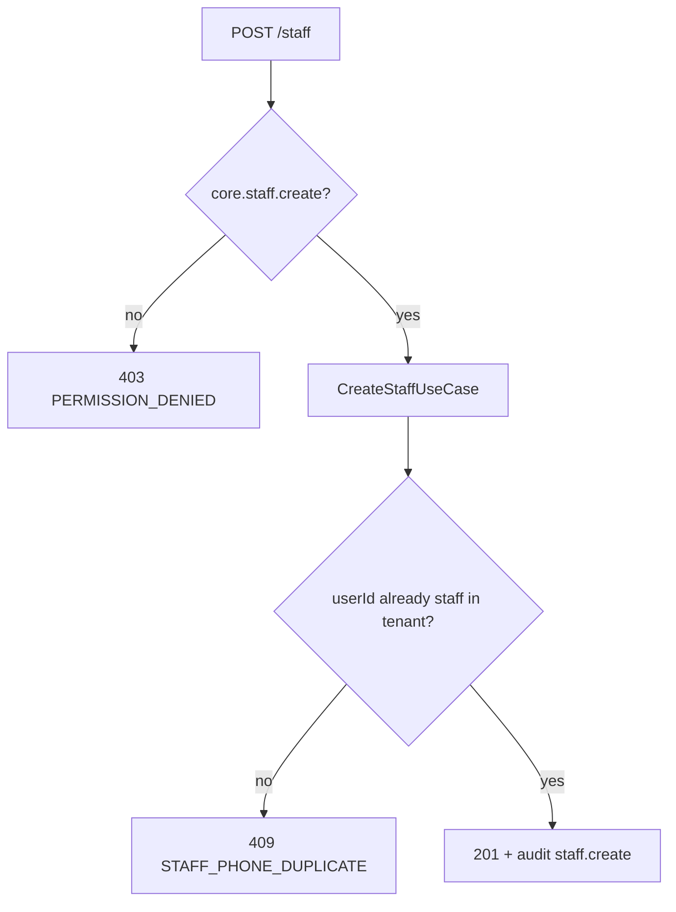

# TASK-096: API — Staff Controller

## Metadata

| فیلد | مقدار |
|------|--------|
| Phase | 1 |
| Epic | Epic-08-Core-Admin |
| ID | TASK-096 |
| Priority | P0 |
| Depends on | TASK-090, TASK-092, TASK-094, TASK-042, TASK-043, TASK-045 |
| Blocks | — |
| Estimated | 6h |

---

## هدف

`StaffController` — CRUD کارمند + assign/remove roles. `@Controller('v1/staff')`. Core module endpoints.

---

## Endpoints

### `GET /api/v1/staff`

| Item | Value |
|------|-------|
| Permission | `core.staff.view` |
| Query | `status`, `branchId`, `cursor`, `limit`, `search` |

**Response 200:** per api-contracts.md § staff list

### `POST /api/v1/staff`

| Permission | `core.staff.create` |
| Audit | `staff.create` |

**Request:**

```json
{
  "phone": "09121234567",
  "name": "رضا کریمی",
  "jobTitle": "فروشنده",
  "dataScope": "branch",
  "assignedBranchIds": ["uuid"],
  "primaryBranchId": "uuid",
  "roleIds": ["uuid"]
}
```

### `GET /api/v1/staff/:id`

| Permission | `core.staff.view` |

### `PATCH /api/v1/staff/:id`

| Permission | `core.staff.update` |
| Audit | `staff.update` |

### `DELETE /api/v1/staff/:id`

| Permission | `core.staff.delete` |
| Note | Soft delete |
| Audit | `staff.delete` |

### `POST /api/v1/staff/:staffId/roles`

| Permission | `core.staff.update` |
| Delegate | TASK-092 AssignRoleUseCase |
| Audit | `staff.role.assign` |

### `DELETE /api/v1/staff/:staffId/roles/:roleId`

| Permission | `core.staff.update` |
| Audit | `staff.role.remove` |

### `PATCH /api/v1/staff/me/active-branch`

| Permission | authenticated staff |
| Body | `{ "branchId": "uuid" }` |
| Errors | `BRANCH_NOT_ALLOWED` |

> Existing from api-contracts §8 — ensure implemented/wired.

---

## Data Scope

| Scope | List staff | View staff |
|-------|------------|------------|
| `all` | all in tenant | all |
| `branch` | staff with overlapping branches | same |
| `own` | self only | self |

Mutations: typically **owner only** (`core.staff.create`).

---

## Error Codes

| سناریو | HTTP | Code |
|--------|------|------|
| Phone duplicate | 409 | `STAFF_PHONE_DUPLICATE` |
| Delete self | 409 | `STAFF_CANNOT_DELETE_SELF` |
| Delete owner | 409 | `STAFF_LAST_OWNER` |
| Active branch not allowed | 403 | `BRANCH_NOT_ALLOWED` |

---

## Flow — Create Staff



---

## فایل‌ها

| عمل | مسیر |
|-----|------|
| Create | `apps/api/src/core/staff/staff.controller.ts` |
| Create | `apps/api/src/core/staff/staff.module.ts` |
| Create | `apps/api/src/core/staff/staff.integration.spec.ts` |

---

## تست

- [ ] Integration: create staff + assign role
- [ ] Integration: cannot delete self
- [ ] RBAC: manager cannot create staff (if policy)
- [ ] active-branch PATCH

---

## Policy Alignment

- [ ] ADR-015 staff branch fields
- [ ] SOFT-DELETE-POLICY
- [ ] SF-008 owner-only staff management

---

## Self-Review Score

| محور | سقف | امتیاز |
|------|-----|--------|
| Metadata | 10 | 10 |
| Completeness | 25 | 25 |
| Policy | 25 | 25 |
| Executability | 25 | 25 |
| Alignment | 15 | 15 |
| **جمع** | **100** | **100** |

---

## مراجع

- `docs/02-architecture/api-contracts.md` § staff
- `docs/02-architecture/rbac.md` — core.staff.*
