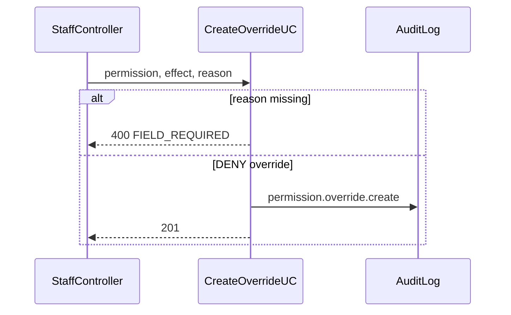

# TASK-097: API — Roles Controller

## Metadata

| فیلد | مقدار |
|------|--------|
| Phase | 1 |
| Epic | Epic-08-Core-Admin |
| ID | TASK-097 |
| Priority | P0 |
| Depends on | TASK-091, TASK-092, TASK-093, TASK-094, TASK-042, TASK-043 |
| Blocks | — |
| Estimated | 6h |

---

## هدف

`RolesController` — CRUD نقش + permission override endpoints زیر staff. Owner-only mutations for custom roles.

---

## Endpoints

### `GET /api/v1/roles`

| Permission | `core.role.view` |
| Response | system + custom roles for tenant |

```json
{
  "data": [
    {
      "id": "uuid",
      "code": "owner",
      "name": "مالک",
      "isSystem": true,
      "permissions": ["..."],
      "dataScope": "all"
    },
    {
      "id": "uuid",
      "code": "accountant",
      "name": "حسابدار",
      "isSystem": false,
      "permissions": ["installments.report.dashboard"],
      "dataScope": "all"
    }
  ]
}
```

### `POST /api/v1/roles`

| Permission | `core.role.create` |
| Audit | `role.create` |

### `GET /api/v1/roles/:id`

| Permission | `core.role.view` |

### `PATCH /api/v1/roles/:id`

| Permission | `core.role.update` |
| Audit | `role.update` |
| Block | system roles → 409 `ROLE_IS_SYSTEM` |

### `DELETE /api/v1/roles/:id`

| Permission | `core.role.delete` |
| Audit | `role.delete` |

### Permission Overrides (staff sub-resource)

Also exposed on `StaffController` or nested here:

```
GET    /api/v1/staff/:staffId/permission-overrides
POST   /api/v1/staff/:staffId/permission-overrides
DELETE /api/v1/staff/:staffId/permission-overrides/:overrideId
```

| Permission | `core.staff.update` (owner) |
| Audit | `permission.override.create`, `permission.override.remove` |

**Create body:**

```json
{
  "permission": "installments.installment.waive",
  "effect": "deny",
  "reason": "محدودیت موقت به دلیل تخلف",
  "expiresAt": "2025-03-01T00:00:00.000Z"
}
```

---

## Error Codes

| سناریو | HTTP | Code |
|--------|------|------|
| System role mutate | 409 | `ROLE_IS_SYSTEM` |
| Code duplicate | 409 | `ROLE_CODE_DUPLICATE` |
| Invalid permission | 404 | `PERMISSION_NOT_FOUND` |
| Override duplicate | 409 | `OVERRIDE_ALREADY_EXISTS` |
| Missing reason | 400 | `FIELD_REQUIRED` |

---

## Flow — Permission Override



---

## فایل‌ها

| عمل | مسیر |
|-----|------|
| Create | `apps/api/src/core/roles/roles.controller.ts` |
| Update | `apps/api/src/core/staff/staff.controller.ts` — override routes |
| Create | `apps/api/src/core/roles/roles.integration.spec.ts` |

---

## تست

- [ ] Integration: owner creates custom role
- [ ] Integration: cannot patch owner role
- [ ] Integration: DENY override blocks permission
- [ ] RBAC: non-owner denied create role

---

## Policy Alignment

- [ ] rbac.md — DENY > GRANT, owner-only custom roles
- [ ] system roles immutable
- [ ] reason mandatory on override

---

## Self-Review Score

| محور | سقف | امتیاز |
|------|-----|--------|
| Metadata | 10 | 10 |
| Completeness | 25 | 25 |
| Policy | 25 | 25 |
| Executability | 25 | 25 |
| Alignment | 15 | 15 |
| **جمع** | **100** | **100** |

---

## مراجع

- `docs/02-architecture/rbac.md`
- `TASK-091`, `TASK-093`
