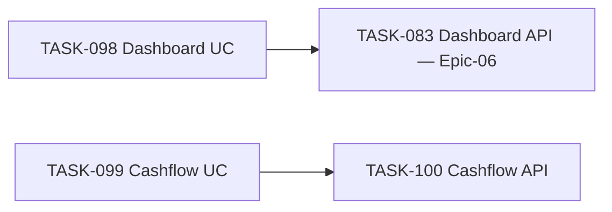

# Epic-09 — Reports

> **Phase:** 1 — Installments  
> **وضعیت:** Ready for implementation  
> **ADR:** ADR-007, ADR-015

---

## هدف Epic

Use caseهای گزارش داشبورد و پیش‌بینی جریان نقدی + API endpoints. KPIها از `REPORTS.md` §1؛ cashflow ۶ ماهه با گروه‌بندی ماهانه. Cache Redis برای داشبورد (TTL 5 دقیقه).

---

## Tasks

| ID | فایل | عنوان | Depends | Priority |
|----|------|--------|---------|----------|
| 098 | [TASK-098-usecase-dashboard-report.md](./TASK-098-usecase-dashboard-report.md) | Use Case — Dashboard Report | TASK-045, TASK-047, TASK-059 | P0 |
| 099 | [TASK-099-usecase-cashflow-forecast.md](./TASK-099-usecase-cashflow-forecast.md) | Use Case — Cashflow Forecast | TASK-045, TASK-059 | P0 |
| 100 | [TASK-100-api-reports-cashflow.md](./TASK-100-api-reports-cashflow.md) | API — Reports Cashflow | TASK-099, TASK-042–045 | P0 |

---

## Dependency Graph

> **نکته:** TASK-083 (Epic-06) به TASK-098 وابسته است — Epic-09 قبل از تکمیل TASK-083 اجرا شود.

---

## Policy Notes

| موضوع | قانون |
|-------|--------|
| Data scope | `BRANCH`/`OWN` — فیلتر `branchId` روی sale/installment |
| Money | مجموع‌ها `bigint` — response به صورت `string` |
| Cache dashboard | Redis TTL **5 دقیقه** — key: `report:{tenantId}:dashboard:{scopeHash}` |
| Cache invalidation | پس از `payment.confirm`, `sale.create`, `sale.cancel` |
| Cashflow | `pending` + `overdue`؛ ۶ ماه آینده؛ گروه ماهانه |
| Timezone | محاسبه «امروز» با `tenant.timezone` (Asia/Tehran) |

---

## مراجع

- `docs/03-modules/installments/REPORTS.md` §1, §3, §9
- `docs/02-architecture/api-contracts.md` § reports
- `docs/02-architecture/rbac.md` — `installments.report.dashboard`
