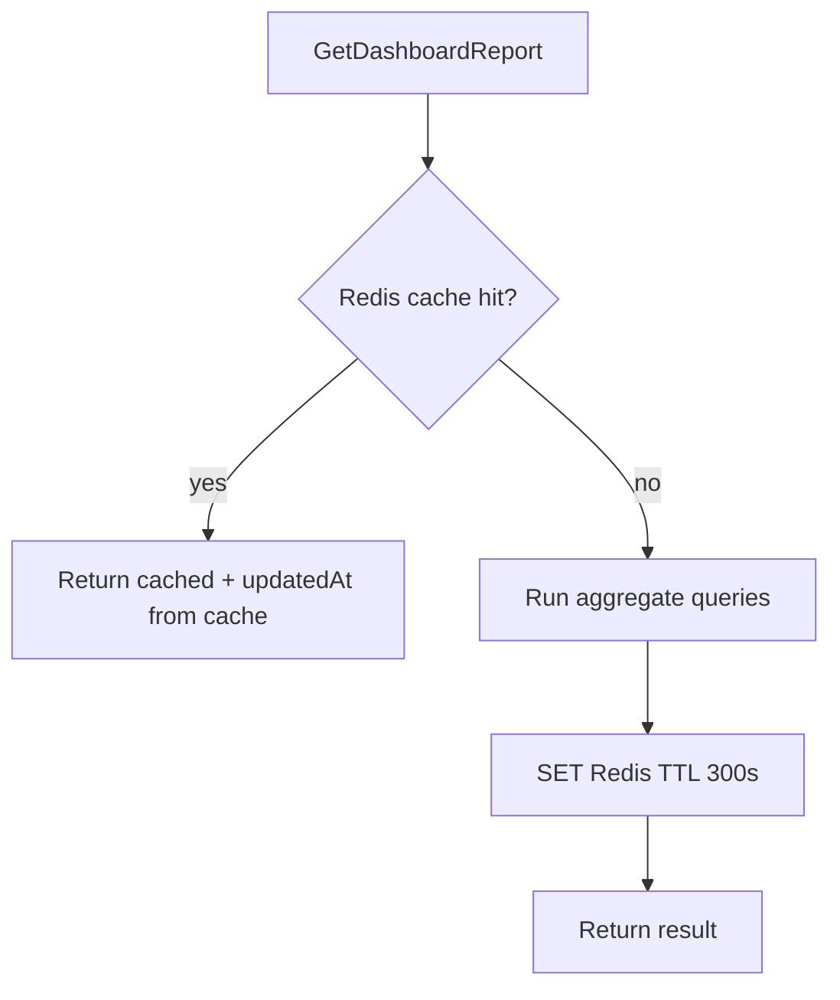

# TASK-098: Use Case — Dashboard Report

## Metadata

| فیلد | مقدار |
|------|--------|
| Phase | 1 |
| Epic | Epic-09-Reports |
| ID | TASK-098 |
| Priority | P0 |
| Depends on | TASK-045, TASK-047, TASK-059 |
| Blocks | TASK-083 |
| Estimated | 8h |

---

## هدف

`GetDashboardReportUseCase` — محاسبه KPIهای داشبورد per REPORTS.md §1.1. Redis cache TTL **5 دقیقه**. Data scope filtering. همه sums به صورت `bigint` → string در output.

---

## معیار پذیرش

- [ ] All KPIs from REPORTS.md §1.1 Summary Cards
- [ ] Timezone-aware «today» و «this month» (`tenant.timezone`)
- [ ] Data scope: branch/own filters on sale.branchId / sellerId
- [ ] Redis cache key `report:{tenantId}:dashboard:{scopeHash}` TTL 300s
- [ ] Invalidation on payment.confirm, sale.create, sale.cancel
- [ ] `updatedAt` timestamp in result
- [ ] No audit (read-only aggregate)

---

## Output

```typescript
export type DashboardReport = {
  todayDueCount: number;
  todayDueAmountRial: string;
  overdueCount: number;
  overdueAmountRial: string;
  pendingPaymentCount: number;
  todayCollectedRial: string;
  thisMonthCollectedRial: string;
  activeSalesCount: number;
  customersWithDebtCount: number;
  updatedAt: string;
};
```

---

## KPI Definitions (REPORTS.md §1.1)

| Field | SQL Logic |
|-------|-----------|
| `todayDueCount` | installments: status IN (pending, overdue), due_date = today(tz) |
| `todayDueAmountRial` | SUM amount above |
| `overdueCount` | status = overdue |
| `overdueAmountRial` | SUM overdue amounts |
| `pendingPaymentCount` | payment_attempts status = pending |
| `todayCollectedRial` | paid installments where paidAt date = today |
| `thisMonthCollectedRial` | paid in current month |
| `activeSalesCount` | sales status = active |
| `customersWithDebtCount` | DISTINCT customers with overdue installments |

**Scope filter:** append `AND s.branch_id IN (:branchIds)` or `s.seller_id = :actorId`

---

## Cache Strategy

| Item | Value |
|------|-------|
| TTL | **300 seconds (5 min)** |
| Key | `report:{tenantId}:dashboard:{scopeHash}` |
| scopeHash | hash of branchIds or 'all' or sellerId |
| Invalidation | DEL key on sale.create, sale.cancel, payment.confirm |



---

## Input

```typescript
{
  tenantId: string;
  staffContext: DataScopeStaffContext;
  branchId?: string;  // optional override
  timezone: string;   // from tenant
}
```

---

## Error Codes

| سناریو | HTTP | Code |
|--------|------|------|
| branchId outside scope | 403 | `BRANCH_NOT_ALLOWED` |
| Redis down | — | compute without cache (degraded) |

---

## فایل‌ها

| عمل | مسیر |
|-----|------|
| Create | `packages/application/src/installments/reports/get-dashboard-report.use-case.ts` |
| Create | `packages/application/src/installments/reports/get-dashboard-report.use-case.spec.ts` |
| Create | `packages/infrastructure/src/persistence/installment-report.repository.ts` |
| Create | `packages/infrastructure/src/cache/report-cache.service.ts` |

---

## مراحل پیاده‌سازی

1. Repository aggregate methods with scope params
2. Timezone helper for today/month boundaries (Asia/Tehran)
3. Redis cache wrapper
4. Cache invalidation hooks in sale/payment use cases (events)
5. Unit tests with fixed dates
6. Integration test with seed data

---

## Edge Cases

| سناریو | رفتار |
|--------|--------|
| No installments | all zeros, amounts "0" |
| branchId filter + scope branch | intersect |
| Month boundary at 00:00 Tehran | correct month bucket |

---

## تست

- [ ] Unit: scope filter in SQL builder
- [ ] Unit: cache hit/miss
- [ ] Integration: counts match seeded data
- [ ] Integration: branch scope reduces overdue count

---

## Policy Alignment

- [ ] REPORTS.md §1, §9 (cache documented — 5min per Phase 1 spec)
- [ ] ADR-015 scope
- [ ] Money bigint

---

## مراجع

- `docs/03-modules/installments/REPORTS.md` §1.1, §9
- `Phases/Phase-1-Installments/Epic-06-Installments-API/TASK-083-api-reports-dashboard.md`

---

## Self-Review Score

| محور | سقف | امتیاز |
|------|-----|--------|
| Metadata | 10 | 10 |
| Completeness | 25 | 25 |
| Policy | 25 | 25 |
| Executability | 25 | 25 |
| Alignment | 15 | 15 |
| **جمع** | **100** | **100** |
