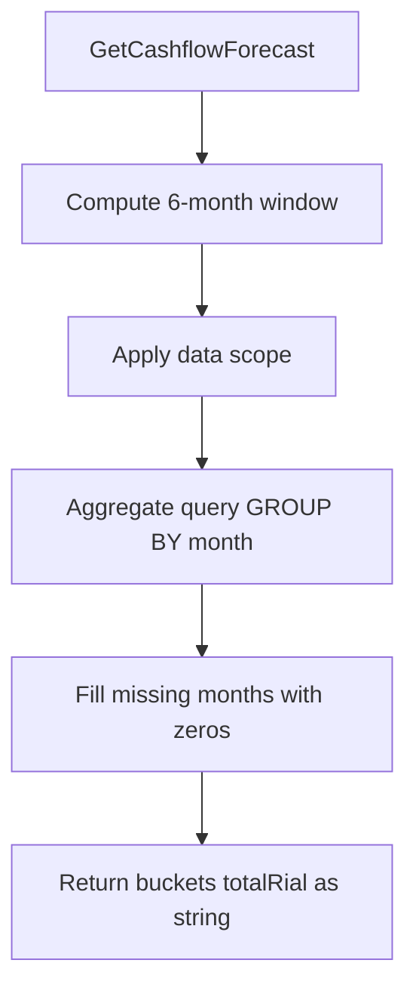

# TASK-099: Use Case — Cashflow Forecast

## Metadata

| فیلد | مقدار |
|------|--------|
| Phase | 1 |
| Epic | Epic-09-Reports |
| ID | TASK-099 |
| Priority | P0 |
| Depends on | TASK-045, TASK-059 |
| Blocks | TASK-100 |
| Estimated | 6h |

---

## هدف

`GetCashflowForecastUseCase` — پیش‌بینی دریافتی ۶ ماه آینده. اقساط `pending` + `overdue` گروه‌بندی شده بر اساس ماه (`DATE_TRUNC('month', due_date)`). Data scope applied.

---

## معیار پذیرش

- [ ] Horizon: 6 months from current month start
- [ ] Status filter: `pending`, `overdue` only
- [ ] Group by calendar month (tenant timezone)
- [ ] Each bucket: `month` (YYYY-MM), `installmentCount`, `totalRial` (string)
- [ ] Include months with zero installments (optional — fill gaps with 0)
- [ ] Data scope branch/own filtering
- [ ] Cache TTL 1 hour (REPORTS.md §9) — optional Phase 1

---

## Output

```typescript
export type CashflowMonthBucket = {
  month: string;              // "2025-04" — Jalali display in UI
  installmentCount: number;
  totalRial: string;          // bigint sum as string
};

export type CashflowForecast = {
  data: CashflowMonthBucket[];
  fromMonth: string;
  toMonth: string;
  updatedAt: string;
};
```

---

## Query (REPORTS.md §3)

```sql
SELECT
    DATE_TRUNC('month', i.due_date AT TIME ZONE :tz) as month,
    COUNT(i.id) as installment_count,
    SUM(i.amount_rial) as expected_rial
FROM installments i
JOIN sales s ON i.sale_id = s.id
WHERE
    i.tenant_id = :tenantId
    AND i.status IN ('pending', 'overdue')
    AND i.due_date >= :startOfCurrentMonth
    AND i.due_date < :startOfMonthPlus6
    AND i.deleted_at IS NULL
    AND s.deleted_at IS NULL
    -- scope: AND s.branch_id IN (:branchIds)
GROUP BY 1
ORDER BY month ASC
```

---

## Data Scope (ADR-015)

| Scope | Filter |
|-------|--------|
| `all` | tenant only |
| `branch` | `sale.branchId IN assignedBranchIds` |
| `own` | `sale.sellerId = actorId` |

---

## Input

```typescript
{
  tenantId: string;
  staffContext: DataScopeStaffContext;
  branchId?: string;
  timezone: string;
}
```

---

## Error Codes

| سناریو | HTTP | Code |
|--------|------|------|
| branchId outside scope | 403 | `BRANCH_NOT_ALLOWED` |

---

## Flow



---

## فایل‌ها

| عمل | مسیر |
|-----|------|
| Create | `packages/application/src/installments/reports/get-cashflow-forecast.use-case.ts` |
| Create | `packages/application/src/installments/reports/get-cashflow-forecast.use-case.spec.ts` |
| Update | `packages/infrastructure/src/persistence/installment-report.repository.ts` |

---

## مراحل پیاده‌سازی

1. Month window calculation in tenant TZ
2. Repository method `getCashflowByMonth`
3. Post-process: ensure 6 entries (pad zeros)
4. Map bigint sums to string
5. Tests with fixtures across month boundaries

---

## Edge Cases

| سناریو | رفتار |
|--------|--------|
| No pending installments | 6 months all zeros |
| Overdue in past month | included if still overdue status |
| Leap month boundaries | TZ correct |

---

## تست

- [ ] Unit: month bucket padding
- [ ] Unit: scope SQL fragment
- [ ] Integration: seeded installments → correct sums
- [ ] Integration: branch scope limits buckets

---

## Policy Alignment

- [ ] REPORTS.md §3
- [ ] ADR-015
- [ ] bigint as string

---

## مراجع

- `docs/03-modules/installments/REPORTS.md` §3
- `docs/02-architecture/api-contracts.md` § cashflow

---

## Self-Review Score

| محور | سقف | امتیاز |
|------|-----|--------|
| Metadata | 10 | 10 |
| Completeness | 25 | 25 |
| Policy | 25 | 25 |
| Executability | 25 | 25 |
| Alignment | 15 | 15 |
| **جمع** | **100** | **100** |
