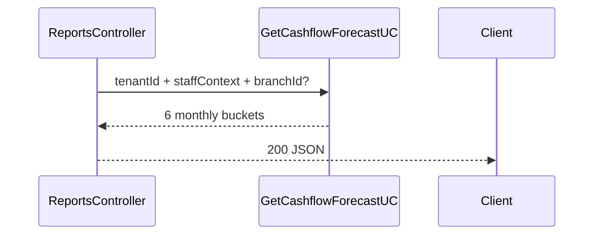

# TASK-100: API — Reports Cashflow

## Metadata

| فیلد | مقدار |
|------|--------|
| Phase | 1 |
| Epic | Epic-09-Reports |
| ID | TASK-100 |
| Priority | P0 |
| Depends on | TASK-099, TASK-042, TASK-043, TASK-044, TASK-045 |
| Blocks | — |
| Estimated | 3h |

---

## هدف

`GET /api/v1/reports/cashflow` — wiring به `GetCashflowForecastUseCase`. Permission `installments.report.dashboard`. Response ماهانه ۶ ماهه (نه daily api-contracts stub).

---

## معیار پذیرش

- [ ] `GET /api/v1/reports/cashflow`
- [ ] Permission `installments.report.dashboard`
- [ ] `@RequireModule('installments')`, `@ApplyDataScope()`
- [ ] 6-month monthly buckets
- [ ] `totalRial` as string per bucket
- [ ] Optional query `branchId`

---

## `GET /api/v1/reports/cashflow`

| Item | Value |
|------|-------|
| Method | `GET` |
| Path | `/api/v1/reports/cashflow` |
| Auth | Staff JWT |
| Module | `installments` |
| Permission | `installments.report.dashboard` |
| Headers | `Authorization`, `X-Branch-Id` (optional) |
| Query | `branchId` (optional) |

**Response 200:**

```json
{
  "data": {
    "buckets": [
      { "month": "2025-01", "totalRial": "15000000", "installmentCount": 8 },
      { "month": "2025-02", "totalRial": "22000000", "installmentCount": 12 },
      { "month": "2025-03", "totalRial": "18000000", "installmentCount": 10 },
      { "month": "2025-04", "totalRial": "25000000", "installmentCount": 15 },
      { "month": "2025-05", "totalRial": "12000000", "installmentCount": 7 },
      { "month": "2025-06", "totalRial": "9000000", "installmentCount": 5 }
    ],
    "fromMonth": "2025-01",
    "toMonth": "2025-06",
    "updatedAt": "2025-01-15T09:00:00.000Z"
  },
  "meta": { "requestId": "uuid" }
}
```

> **Note:** api-contracts.md shows daily `date` field — Phase 1 implements **monthly** forecast per REPORTS.md §3 and user spec. Update api-contracts in separate docs sync task.

---

## Data Scope (ADR-015)

| Scope | Behavior |
|-------|----------|
| `all` | all pending+overdue installments in tenant |
| `branch` | filter by assigned branches |
| `own` | filter by sellerId |

---

## Error Codes

| سناریو | HTTP | Code |
|--------|------|------|
| branchId outside scope | 403 | `BRANCH_NOT_ALLOWED` |
| Permission denied | 403 | `PERMISSION_DENIED` |
| Module disabled | 403 | `MODULE_NOT_ENABLED` |

---

## Flow



---

## فایل‌ها

| عمل | مسیر |
|-----|------|
| Update | `apps/api/src/installments/reports/reports.controller.ts` |
| Create | `apps/api/src/installments/reports/reports-cashflow.integration.spec.ts` |
| Consume | `packages/application/src/installments/reports/get-cashflow-forecast.use-case.ts` |
| Create/Update | `packages/contracts/src/installments/reports.schema.ts` |

---

## مراحل پیاده‌سازی

1. Add `getCashflow()` method to ReportsController
2. Parse optional `branchId` query
3. Delegate to TASK-099 use case
4. Map to response DTO
5. Integration tests

---

## Edge Cases & Errors

| سناریو | HTTP / Code | رفتار |
|--------|-------------|--------|
| No data | 200 | 6 buckets with zeros |
| Invalid branchId UUID | 400 | VALIDATION_ERROR |

---

## تست

- [ ] Integration: returns 6 months
- [ ] Integration: sums match DB
- [ ] RBAC: viewer allowed; denied without permission
- [ ] Data scope: branch staff sees reduced totals

---

## Policy Alignment

- [ ] REPORTS.md §3 six-month forecast
- [ ] ADR-015
- [ ] bigint string in JSON

---

## مراجع

- `docs/03-modules/installments/REPORTS.md` §3
- `Phases/Phase-1-Installments/Epic-09-Reports/TASK-099-usecase-cashflow-forecast.md`

---

## Self-Review Score

| محور | سقف | امتیاز |
|------|-----|--------|
| Metadata | 10 | 10 |
| Completeness | 25 | 25 |
| Policy | 25 | 25 |
| Executability | 25 | 25 |
| Alignment | 15 | 15 |
| **جمع** | **100** | **100** |
