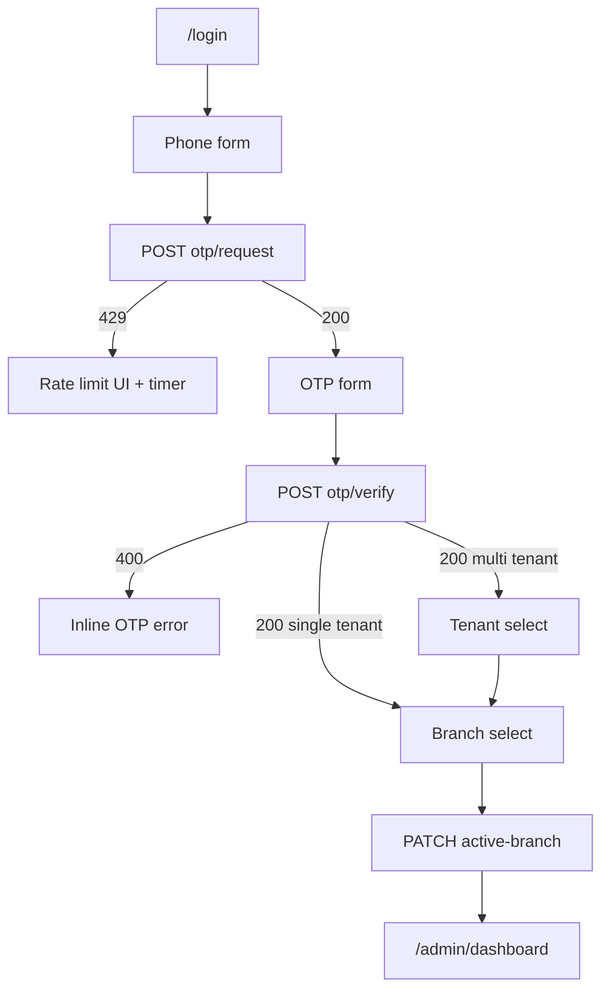

# TASK-101: Frontend — OTP Login (Staff)

## Metadata

| فیلد | مقدار |
|------|--------|
| Phase | 1 |
| Epic | Epic-10-Frontend-Layout-Auth |
| ID | TASK-101 |
| Priority | P0 |
| Depends on | TASK-007, TASK-054, TASK-055, TASK-051, TASK-080 |
| Blocks | TASK-102, TASK-104 |
| Estimated | 8h |

---

## هدف

صفحه ورود Staff با OTP مطابق SF-001: شماره تلفن → کد OTP → انتخاب tenant (اگر چند tenant) → انتخاب شعبه فعال → redirect به داشبورد. مدیریت cookie refresh و خطای rate limit (429).

---

## معیار پذیرش

- [ ] Route `/login` در route group `(auth)` قابل دسترسی بدون session
- [ ] Flow کامل SF-001: phone → OTP → tenant select (conditional) → branch select → `/admin/dashboard`
- [ ] `credentials: 'include'` برای refresh cookie (`hivork_staff_refresh`)
- [ ] Access token در memory (React context) — نه localStorage
- [ ] UI خطای 429 با countdown تا retry
- [ ] Redirect authenticated user از `/login` به `/admin/dashboard`
- [ ] middleware محافظ `/admin/*` — redirect به `/login` اگر unauthenticated
- [ ] E2E Playwright: login demo seed → dashboard

---

## مشخصات فنی

### Route

```
apps/web/app/(auth)/login/page.tsx
```

### Permission

صفحه عمومی — بدون permission (pre-auth).

### API Endpoints

| مرحله | Method | Path | توضیح |
|-------|--------|------|--------|
| 1 | POST | `/api/v1/auth/otp/request` | `{ phone, actor: "staff", intent: "login" }` |
| 2 | POST | `/api/v1/auth/otp/verify` | `{ phone, code, actor: "staff", intent: "login", tenantSlug? }` |
| 3 | GET | `/api/v1/staff/me/tenants` | لیست tenantهای staff (اگر verify چند tenant برگرداند) |
| 4 | GET | `/api/v1/branches` | لیست شعب قابل دسترسی |
| 5 | PATCH | `/api/v1/staff/me/active-branch` | `{ branchId }` — TASK-092 |
| 6 | POST | `/api/v1/auth/refresh` | تمدید access token (cookie) |
| 7 | POST | `/api/v1/auth/logout` | خروج |

### Wireframe

```
┌─────────────────────────────────────────────┐
│              [لوگو Hivork]                  │
│         ورود به پنل فروشنده                 │
├─────────────────────────────────────────────┤
│  Step 1/4: شماره موبایل                     │
│  ┌─────────────────────────────────────┐   │
│  │ ۰۹۱۲۱۲۳۴۵۶۷              [تلفن]    │   │
│  └─────────────────────────────────────┘   │
│  کد تأیید به این شماره پیامک می‌شود.       │
│                    [ارسال کد تأیید →]       │
├─────────────────────────────────────────────┤
│  Step 2/4: کد تأیید (۶ رقم)                 │
│  ┌─┬─┬─┬─┬─┬─┐                              │
│  │ │ │ │ │ │ │  OTP inputs                 │
│  └─┴─┴─┴─┴─┴─┘                              │
│  ارسال مجدد (۰:۴۵)                          │
│                    [تأیید و ادامه →]        │
├─────────────────────────────────────────────┤
│  Step 3/4: انتخاب فروشگاه (اگر >1 tenant)   │
│  ○ فروشگاه موبایل علی                       │
│  ○ فروشگاه لوازم خانگی رضا                  │
├─────────────────────────────────────────────┤
│  Step 4/4: انتخاب شعبه فعال                 │
│  ▼ شعبه مرکزی                               │
│                    [ورود به پنل →]          │
└─────────────────────────────────────────────┘
```

### Flow (mermaid)



### Form — Step 1: Phone

| Element | مقدار (fa) |
|---------|------------|
| Label | شماره موبایل |
| Placeholder | مثال: ۰۹۱۲۱۲۳۴۵۶۷ |
| Help | شماره‌ای که با آن در سیستم ثبت شده‌اید را وارد کنید. |
| input type | `tel` |
| inputMode | `numeric` |
| aria-label | شماره موبایل برای ورود |
| Validation client | `phoneSchema` از `@hivork/contracts` — `09xxxxxxxxx` |
| Validation server | `INVALID_PHONE` → فیلد phone؛ `PHONE_NOT_FOUND` → toast |
| Submit loading | دکمه disabled + spinner «در حال ارسال…» |

### Form — Step 2: OTP

| Element | مقدار (fa) |
|---------|------------|
| Label | کد تأیید |
| Placeholder | — (۶ خانه جدا) |
| Help | کد ۶ رقمی ارسال‌شده به {phoneMasked} را وارد کنید. |
| input type | `text` inputMode `numeric` maxlength 1 per cell |
| aria-label | رقم {n} از ۶ کد تأیید |
| Validation client | ۶ رقم عددی |
| Validation server | `AUTH_OTP_INVALID` / `AUTH_OTP_EXPIRED` → inline |
| Resend | بعد از ۶۰ثانیه؛ دوباره `otp/request` |

### Auth Context (`lib/auth/staff-auth-context.tsx`)

```typescript
// Client Component — holds accessToken in memory
// On mount: try POST /auth/refresh if cookie exists
// Expose: { accessToken, staff, tenant, permissions, setActiveBranch, logout }
// apiFetch wrapper adds Authorization: Bearer {accessToken}
// apiFetch adds X-Branch-Id from activeBranchId state
```

### Cookie Handling

| Cookie | نام | محل |
|--------|-----|-----|
| Refresh staff | `hivork_staff_refresh` | httpOnly — set by API |
| Access | memory only | StaffAuthContext |

### Edge Cases & Errors

| سناریو | HTTP / Code | رفتار UI |
|--------|-------------|----------|
| Rate limit OTP | 429 `AUTH_OTP_RATE_LIMITED` | Banner قرمز + countdown ۶۰ثانیه + disable submit |
| OTP invalid | 400 `AUTH_OTP_INVALID` | shake animation + پیام زیر OTP |
| OTP expired | 400 `AUTH_OTP_EXPIRED` | پیام + دکمه «ارسال مجدد کد» |
| Staff inactive | 403 `STAFF_INACTIVE` | toast + لینک پشتیبانی |
| Network error | — | toast + دکمه retry |
| Single tenant | verify 200 | skip step 3 |
| Single branch | branches.length === 1 | auto-select + skip UI |
| Already logged in | — | redirect `/admin/dashboard` |

---

## فایل‌ها

| عمل | مسیر |
|-----|------|
| Create | `apps/web/app/(auth)/login/page.tsx` |
| Create | `apps/web/app/(auth)/layout.tsx` |
| Create | `apps/web/components/auth/phone-step.tsx` |
| Create | `apps/web/components/auth/otp-step.tsx` |
| Create | `apps/web/components/auth/tenant-select-step.tsx` |
| Create | `apps/web/components/auth/branch-select-step.tsx` |
| Create | `apps/web/lib/auth/staff-auth-context.tsx` |
| Create | `apps/web/lib/auth/use-staff-auth.ts` |
| Update | `apps/web/middleware.ts` — protect `/admin/*` |
| Update | `apps/web/lib/api/client.ts` — auth headers |

---

## مراحل پیاده‌سازی

1. Multi-step wizard با state machine محلی (useReducer)
2. Integrate `phoneSchema` + OTP schema از contracts
3. `apiFetch` با `credentials: 'include'`
4. StaffAuthContext + provider در root `(seller)` layout
5. Rate limit countdown component
6. Tenant/branch steps conditional
7. middleware redirect logic
8. Playwright E2E با demo seed

---

## تست

- [ ] Unit: phone normalization display
- [ ] Component: OTP input auto-focus next cell
- [ ] E2E: full login flow demo-shop → dashboard
- [ ] E2E: 429 shows countdown (mock API)

---

## UX

- [x] Form §5: labels, placeholders, help, validation fa, loading, server errors per field
- [x] a11y: aria-labels, focus trap in steps, focus first OTP on step enter
- [x] RTL: `ms-`/`me-` spacing
- [x] Mobile: `tel` input, large touch targets (min 44px)
- [x] Unsaved warning: N/A (no partial persist except step state)

---

## Policy Alignment

- [x] EXCELLENCE-STANDARDS §5 Forms, §6 Flows
- [x] ADR-015 — branch session after login
- [x] TASK-055 Flow B — no register/verify contradiction
- [x] SOFT-DELETE-POLICY — N/A

---

## مراجع

- `docs/03-modules/installments/STAFF-FLOWS.md` — SF-001
- `docs/02-architecture/api-contracts.md` — §3 Auth, §8 Active Branch
- `Phases/Phase-0-Foundation/Epic-06-Auth/TASK-055-onboarding-auth-flow.md`
- `docs/08-decisions/adr-log.md` — ADR-015

---

## Self-Review Score

| محور | سقف | امتیاز | یادداشت |
|------|-----|--------|---------|
| Metadata | /10 | 10 | Depends/Blocks کامل |
| Completeness | /25 | 25 | Wireframe, API, forms, flow |
| Policy | /25 | 24 | ADR-015, no token in localStorage |
| Executability | /25 | 25 | Edge cases + files + steps |
| Alignment | /15 | 15 | SF-001 + api-contracts |
| **جمع** | **/100** | **99** | ✅ Ready |
