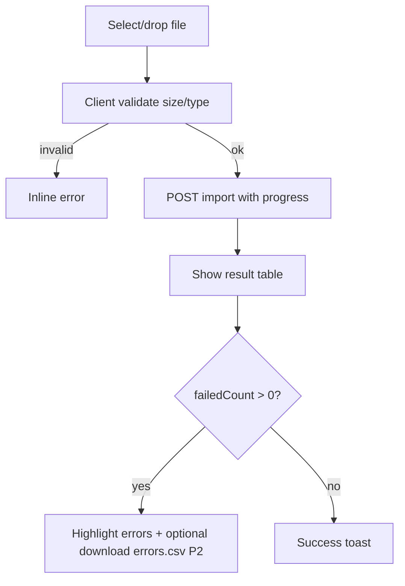

# TASK-108: Frontend — Customer Import Excel

## Metadata

| فیلد | مقدار |
|------|--------|
| Phase | 1 |
| Epic | Epic-11-Frontend-Customer-Pages |
| ID | TASK-108 |
| Priority | P0 |
| Depends on | TASK-106, TASK-086 |
| Blocks | — |
| Estimated | 8h |

---

## هدف

صفحه import مشتریان از Excel: drag-drop، دانلود template، progress آپلود، و جدول نتیجه با خطاهای per-row — مطابق SF-007.2.

---

## معیار پذیرش

- [ ] Route `/admin/customers/import`
- [ ] Permission: `installments.customer.import`
- [ ] Drag-drop zone + file picker (.xlsx, max 5MB)
- [ ] لینک دانلود template Excel (static asset)
- [ ] Progress bar هنگام upload
- [ ] Result summary: totalRows, successCount, failedCount
- [ ] Error table: row, phone, error code → fa message
- [ ] Idempotency-Key header on submit
- [ ] States: idle, uploading, success, partial, error

---

## مشخصات فنی

### Route

```
apps/web/app/(seller)/admin/customers/import/page.tsx
```

### Permission

`installments.customer.import`

### API Endpoints

```
POST /api/v1/customers/import
Content-Type: multipart/form-data
Header: Idempotency-Key: {uuid}
Body: file
```

### Template Columns

| Column | Required | Example |
|--------|----------|---------|
| phone | ✅ | 09121234567 |
| name | ✅ | حسین احمدی |
| localCode | ❌ | C-001 |
| tags | ❌ | vip,regular |
| notes | ❌ | مشتری قدیمی |

Static file: `apps/web/public/templates/customer-import-template.xlsx`

### Wireframe

```
Breadcrumb: خانه > مشتریان > ورود از Excel

ورود مشتریان از Excel
─────────────────────────────────────────
[📥 دانلود فایل نمونه]

┌ ─ ─ ─ ─ ─ ─ ─ ─ ─ ─ ─ ─ ─ ─ ─ ─ ─ ┐
│     فایل Excel را اینجا رها کنید    │
│     یا [انتخاب فایل]                │
│     فرمت: .xlsx — حداکثر ۵ مگابایت  │
└ ─ ─ ─ ─ ─ ─ ─ ─ ─ ─ ─ ─ ─ ─ ─ ─ ─ ┘

(پس از آپلود)
████████████░░░░  ۷۵٪

نتیجه:
  کل ردیف‌ها: ۵۰
  موفق: ۴۷
  ناموفق: ۳

┌─────┬─────────────┬────────────────────────┐
│ ردیف│ شماره       │ خطا                    │
├─────┼─────────────┼────────────────────────┤
│ 12  │ 0912xxx     │ شماره موبایل نامعتبر   │
│ 23  │ 09300000001 │ مشتری تکراری           │
└─────┴─────────────┴────────────────────────┘

[ورود فایل جدید]  [بازگشت به لیست مشتریان]
```

### Flow



### Client Pre-validation

| Check | Message (fa) |
|-------|--------------|
| Not .xlsx | «فقط فایل Excel (.xlsx) مجاز است.» |
| > 5MB | «حجم فایل بیش از ۵ مگابایت است.» |
| Empty file | «فایل خالی است.» |

---

## فایل‌ها

| عمل | مسیر |
|-----|------|
| Create | `apps/web/app/(seller)/admin/customers/import/page.tsx` |
| Create | `apps/web/components/customers/import-dropzone.tsx` |
| Create | `apps/web/components/customers/import-result-table.tsx` |
| Create | `apps/web/public/templates/customer-import-template.xlsx` |
| Create | `apps/web/lib/api/upload-customers.ts` |

---

## مراحل پیاده‌سازی

1. Dropzone با react-dropzone
2. XMLHttpRequest/fetch با onUploadProgress
3. Generate Idempotency-Key per attempt
4. Map error codes via error-messages.fa
5. Template xlsx generation script or hand-crafted
6. RequirePermission wrapper

---

## Edge Cases & Errors

| سناریو | رفتار |
|--------|--------|
| 403 | NoPermissionPage |
| 413 file too large | client block before upload |
| Network abort | retry button |
| Idempotency conflict 409 | show previous result message |
| All rows fail | warning banner + error table |

---

## تست

- [ ] E2E: upload valid template → success count
- [ ] E2E: invalid phone row → error table row
- [ ] Unit: file type validation

---

## UX

- [x] Flow §6: entry, steps, errors, exit, recovery
- [x] Long operation progress bar
- [x] a11y: dropzone keyboard accessible

---

## Policy Alignment

- [x] Audit `customer.import` (backend TASK-086)
- [x] Idempotency for POST
- [x] SF-007.2

---

## مراجع

- `docs/03-modules/installments/STAFF-FLOWS.md` — SF-007.2
- `docs/02-architecture/api-contracts.md` — POST customers/import

---

## Self-Review Score

| محور | سقف | امتیاز |
|------|-----|--------|
| Metadata | /10 | 10 |
| Completeness | /25 | 25 |
| Policy | /25 | 24 |
| Executability | /25 | 25 |
| Alignment | /15 | 15 |
| **جمع** | **/100** | **99** |
