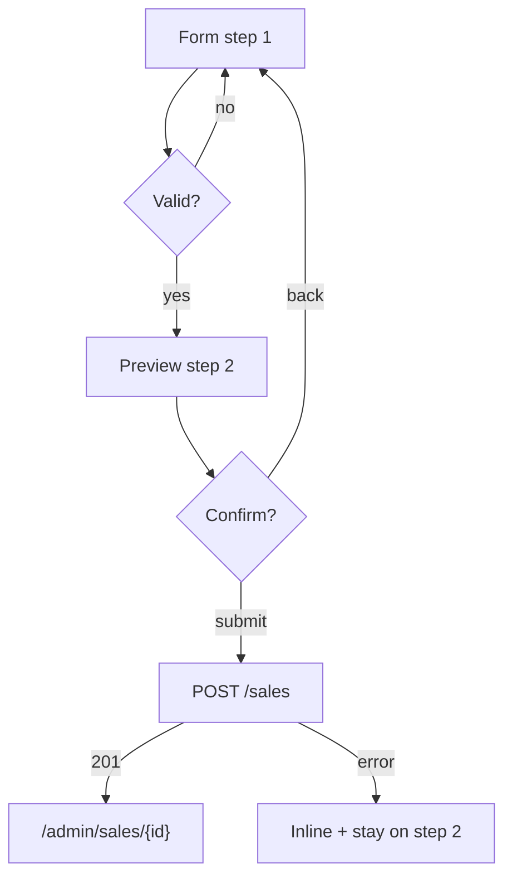

# TASK-110: Frontend — Sale Create + Installment Preview

## Metadata

| فیلد | مقدار |
|------|--------|
| Phase | 1 |
| Epic | Epic-12-Frontend-Sales-Installments |
| ID | TASK-110 |
| Priority | P0 |
| Depends on | TASK-109, TASK-088, TASK-093, TASK-107 |
| Blocks | TASK-111 |
| Estimated | 14h |

---

## هدف

فرم ایجاد فروش مطابق SF-002 با پیش‌نمایش زنده جدول اقساط (محاسبه client-side مطابق BR-005) و مرحله تأیید قبل از submit.

---

## معیار پذیرش

- [ ] Route `/admin/sales/new`
- [ ] Permission: `installments.sale.create`
- [ ] Multi-step: (1) فرم → (2) پیش‌نمایش + تأیید → (3) success redirect
- [ ] Live preview table updates on field change
- [ ] Preview algorithm = `calculateInstallmentSchedule` از TASK-093 / domain BR-005
- [ ] Confirm step shows read-only summary
- [ ] POST با Idempotency-Key
- [ ] Money: TomanInput → ریال bigint string
- [ ] Unsaved warning on step 1

---

## مشخصات فنی

### Route

```
apps/web/app/(seller)/admin/sales/new/page.tsx
```

### Permission

`installments.sale.create`

### API Endpoints

| Method | Path | کاربرد |
|--------|------|--------|
| GET | `/api/v1/customers?search=` | customer combobox |
| POST | `/api/v1/sales` | create sale |
| GET | `/api/v1/branches` | branch select (default active) |

### Form Fields (SF-002 + BR-007)

| Field | Label (fa) | Placeholder | Help (fa) | Required | Type |
|-------|------------|-------------|-----------|----------|------|
| tenantCustomerId | مشتری | جستجو نام یا شماره… | مشتری باید قبلاً ثبت شده باشد | ✅ | combobox |
| branchId | شعبه | — | شعبه ثبت فروش | ✅ | select (default active) |
| title | عنوان فروش | مثال: گوشی سامسونگ S23 | شرح کالا یا خدمت | ❌ | text |
| totalAmountRial | مبلغ کل | ۰ | مبلغ کل به تومان | ✅ | TomanInput |
| downPaymentRial | پیش‌پرداخت | ۰ | مبلغ پرداخت نقدی اول | ❌ | TomanInput |
| installmentCount | تعداد اقساط | ۱۲ | بین ۱ تا ۱۲۰ | ✅ | number inputMode numeric |
| firstDueDate | تاریخ قسط اول | انتخاب تاریخ | باید در آینده باشد (BR-006) | ✅ | JalaliDatePicker |
| intervalDays | فاصله اقساط (روز) | ۳۰ | بین ۱ تا ۳۶۵ روز | ✅ | number (default 30) |
| notes | یادداشت | — | یادداشت داخلی فروش | ❌ | textarea |

### BR-005 Preview Algorithm (client)

```typescript
import { calculateInstallmentSchedule } from '@hivork/domain/installments';

// remaining = total - down
// base = remaining / count; remainder = remaining % count
// first `remainder` installments get base+1
// due dates: firstDueDate + (n-1) * intervalDays
// Display amounts with formatToman
// Sum row must equal remaining — show ✓ or ✗ indicator
```

### Wireframe — Step 1

```
Breadcrumb: خانه > فروش‌ها > فروش جدید

فروش جدید — مرحله ۱ از ۲
─────────────────────────────────────────
مشتری *          [🔍 حسین احمدی ▼]  [＋ مشتری جدید]
شعبه *           [شعبه مرکزی ▼]
عنوان            [________________]
مبلغ کل *        [۶,۰۰۰,۰۰۰ تومان]
پیش‌پرداخت       [۰ تومان]
تعداد اقساط *    [۴]
تاریخ قسط اول *  [۱۴۰۵/۰۵/۰۱]
فاصله (روز) *    [۳۰]
یادداشت          [________________]

── پیش‌نمایش زنده ──
┌──────┬────────────┬────────────┐
│ قسط  │ مبلغ       │ سررسید     │
├──────┼────────────┼────────────┤
│ ۱    │ ۱,۵۰۰,۰۰۰  │ ۱۴۰۵/۰۵/۰۱ │
│ ۲    │ ۱,۵۰۰,۰۰۰  │ ۱۴۰۵/۰۶/۰۱ │
└──────┴────────────┴────────────┘
جمع اقساط: ۶,۰۰۰,۰۰۰ تومان ✓

              [ادامه به تأیید →]
```

### Wireframe — Step 2 Confirm

```
فروش جدید — مرحله ۲ از ۲: تأیید نهایی

مشتری: حسین احمدی (0912***67)
مبلغ کل: ۶,۰۰۰,۰۰۰ تومان | پیش‌پرداخت: ۰
۴ قسط — فاصله ۳۰ روز

[جدول اقساط read-only]

⚠ پس از ثبت، اقساط ایجاد می‌شوند و قابل حذف نیستند.

[← بازگشت و ویرایش]     [ثبت نهایی فروش]
```

### Flow



### Validation

| Rule | Client | Server |
|------|--------|--------|
| down ≤ total | Zod | `DOWN_PAYMENT_EXCEEDS_TOTAL` |
| count 1-120 | Zod | `INSTALLMENT_COUNT_INVALID` |
| interval 1-365 | Zod | `INTERVAL_INVALID` |
| firstDueDate future | Zod | `DUE_DATE_IN_PAST` |
| customer exists | — | `CUSTOMER_NOT_FOUND` |
| branch access | — | `BRANCH_ACCESS_DENIED` |
| plan limit | — | `TENANT_PLAN_LIMIT_EXCEEDED` |

### Submit

- Loading: «در حال ثبت فروش…»
- Header: `Idempotency-Key: crypto.randomUUID()`
- Success toast + redirect `/admin/sales/[id]`

---

## فایل‌ها

| عمل | مسیر |
|-----|------|
| Create | `apps/web/app/(seller)/admin/sales/new/page.tsx` |
| Create | `apps/web/components/sales/sale-create-form.tsx` |
| Create | `apps/web/components/sales/installment-preview-table.tsx` |
| Create | `apps/web/components/sales/sale-confirm-step.tsx` |
| Create | `apps/web/components/sales/customer-combobox.tsx` |
| Create | `apps/web/hooks/use-installment-preview.ts` |

---

## مراحل پیاده‌سازی

1. useInstallmentPreview debounced on form watch
2. Customer combobox async search
3. Link «مشتری جدید» → `/admin/customers/new?returnTo=/admin/sales/new`
4. Two-step wizard با preserved form state
5. Sum validation indicator (BR-005)
6. POST with idempotency
7. Map server errors to fields

---

## Edge Cases & Errors

| سناریو | رفتار |
|--------|--------|
| down = total | single zero installment preview (BR-004) |
| remainder distribution | first N installments +1 Rial — show correctly |
| 409 idempotency | redirect to existing sale |
| Double submit | disable button |
| Customer search empty | CTA create customer |

---

## تست

- [ ] Unit: preview matches BR-005 examples
- [ ] Unit: 10M/3 installments = 3,333,334 + 3,333,333 + 3,333,333
- [ ] E2E: create sale → detail page
- [ ] Integration: preview sum equals remaining

---

## UX

- [x] Form §5 + Flow §6 multi-step
- [x] Financial confirm dialog semantics in step 2
- [x] Toman display, Rial API
- [x] a11y: step indicator aria

---

## Policy Alignment

- [x] BR-005, BR-006, BR-007
- [x] No business logic duplicate — import from domain package
- [x] Idempotency POST مالی
- [x] SF-002

---

## مراجع

- `docs/03-modules/installments/STAFF-FLOWS.md` — SF-002
- `docs/03-modules/installments/BUSINESS-RULES.md` — BR-004–BR-010
- `docs/02-architecture/api-contracts.md` — POST sales

---

## Self-Review Score

| محور | سقف | امتیاز |
|------|-----|--------|
| Metadata | /10 | 10 |
| Completeness | /25 | 25 |
| Policy | /25 | 25 |
| Executability | /25 | 25 |
| Alignment | /15 | 15 |
| **جمع** | **/100** | **100** |
