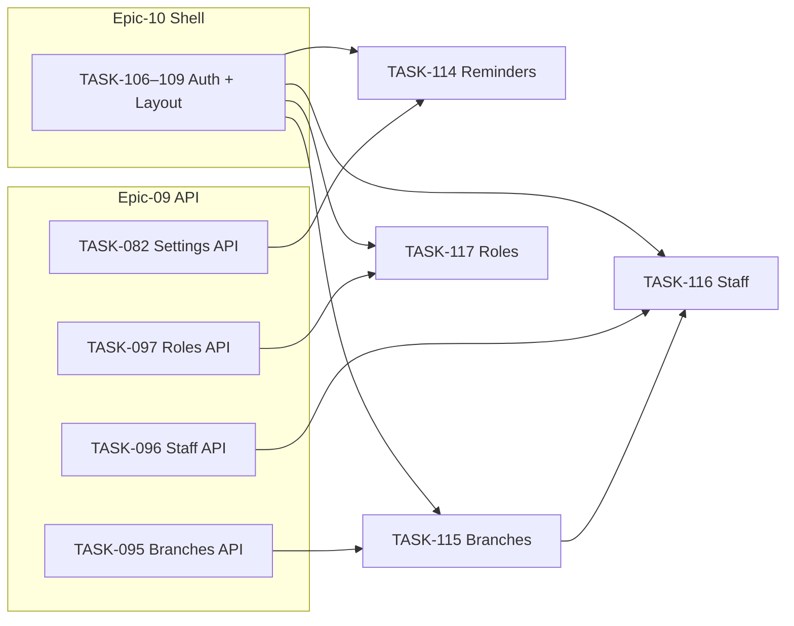

# Epic-13 — Frontend Admin Settings

> **Phase:** 1 — Seller Panel  
> **وضعیت:** Ready for implementation  
> **ADR:** ADR-004, ADR-015, ADR-016

---

## هدف Epic

پیاده‌سازی صفحات مدیریتی admin در Web Panel — تنظیمات یادآور، شعب، کارمندان، و نقش‌ها — با UI فارسی RTL، permission-based rendering، و Excellence §5–§7 کامل.

---

## Tasks

| ID | فایل | عنوان | Depends | Priority |
|----|------|--------|---------|----------|
| 114 | [TASK-114-frontend-settings-reminders.md](./TASK-114-frontend-settings-reminders.md) | Frontend — Settings Reminders | TASK-106–109, TASK-082, TASK-071 | P0 |
| 115 | [TASK-115-frontend-branch-management.md](./TASK-115-frontend-branch-management.md) | Frontend — Branch Management | TASK-106–109, TASK-095, TASK-094 | P0 |
| 116 | [TASK-116-frontend-staff-management.md](./TASK-116-frontend-staff-management.md) | Frontend — Staff Management | TASK-106–109, TASK-096, TASK-094, TASK-115 | P0 |
| 117 | [TASK-117-frontend-role-management.md](./TASK-117-frontend-role-management.md) | Frontend — Role Management | TASK-106–109, TASK-097, TASK-094 | P0 |

---

## Dependency Graph (داخلی Epic)

---

## Policy Notes

| موضوع | قانون |
|-------|--------|
| Permission UI | فقط UX — backend guard اجباری (ADR-004) |
| Soft delete | دکمه «حذف» → soft delete API؛ restore در Phase 2+ |
| Default branch | حذف UI غیرفعال + tooltip (`BRANCH_IS_DEFAULT`) |
| Owner staff | حذف owner در UI ممنوع (`STAFF_IS_OWNER`) |
| System roles | read-only در UI — بدون ویرایش permission matrix |
| Branch override | Phase 1: tenant-level only — branch override UI در فاز بعد |
| RTL + fa-IR | همه label، validation، toast |

---

## مراجع

- `docs/03-modules/installments/STAFF-FLOWS.md` — SF-008, SF-009
- `docs/02-architecture/rbac.md`
- `docs/02-architecture/settings.md`
- `docs/09-development/EXCELLENCE-STANDARDS.md` §5–§7
