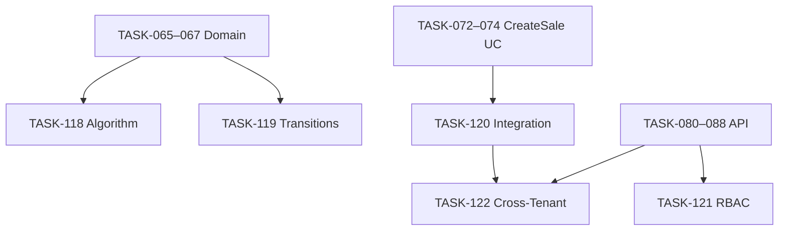

# Epic-14 — Phase 1 Tests

> **Phase:** 1 — Seller Panel  
> **وضعیت:** Ready for implementation  
> **ADR:** ADR-007, ADR-008, ADR-013, ADR-015

---

## هدف Epic

پوشش تست کامل Phase 1: domain invariants (BR-005، state machines)، integration use cases با PostgreSQL واقعی (Testcontainers)، و RBAC/cross-tenant isolation — مطابق `docs/06-operations/testing-observability.md`.

---

## Tasks

| ID | فایل | عنوان | Depends | Priority |
|----|------|--------|---------|----------|
| 118 | [TASK-118-test-domain-installment-algorithm.md](./TASK-118-test-domain-installment-algorithm.md) | Test — Domain Installment Algorithm | TASK-065–067 | P0 |
| 119 | [TASK-119-test-domain-state-transitions.md](./TASK-119-test-domain-state-transitions.md) | Test — Domain State Transitions | TASK-065–067 | P0 |
| 120 | [TASK-120-test-integration-create-sale.md](./TASK-120-test-integration-create-sale.md) | Test — Integration CreateSale | TASK-072–074, TASK-047–050 | P0 |
| 121 | [TASK-121-test-integration-rbac.md](./TASK-121-test-integration-rbac.md) | Test — Integration RBAC | TASK-080–083, TASK-088, TASK-093 | P0 |
| 122 | [TASK-122-test-integration-cross-tenant.md](./TASK-122-test-integration-cross-tenant.md) | Test — Integration Cross-Tenant | TASK-120, TASK-080–088 | P0 |

---

## Dependency Graph (داخلی Epic)

---

## Policy Notes

| موضوع | قانون |
|-------|--------|
| Domain tests | Vitest — zero framework imports — `packages/domain` |
| Integration | Testcontainers PG + Redis — no DB mocks |
| Cross-tenant | 404 not 403 — IDOR prevention |
| RBAC | DENY > GRANT — `PERMISSION_DENIED` code |
| Module guard | `MODULE_NOT_ENABLED` when installments disabled |
| Financial | bigint Rial — exact values in assertions |
| CI | `pnpm turbo test` — specs skip with `describe.runIf(hasDatabase)` |

---

## مراجع

- `docs/06-operations/testing-observability.md` §5–§8
- `docs/03-modules/installments/BUSINESS-RULES.md` — BR-005
- `docs/03-modules/installments/state-machines.md`
- `docs/02-architecture/rbac.md`
