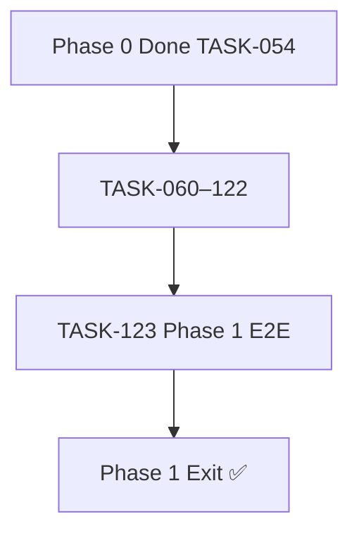

# Epic-15 — Phase 1 Vertical Slice

> **Phase:** 1 — Seller Panel  
> **وضعیت:** Ready for implementation  
> **ADR:** ADR-007, ADR-008, ADR-013, ADR-015, ADR-016

---

## هدف Epic

تأیید end-to-end که **تمام** قطعات Phase 1 با هم کار می‌کنند — exit criteria از `operational-phases.md` §فاز ۱:

> **مشتری → فروش → اقساط → گزارش معوقات**

HTTP E2E spec با NestJS app کامل + PostgreSQL/Redis واقعی. Playwright UI E2E به عنوان P1 stretch مستند می‌شود.

---

## Tasks

| ID | فایل | عنوان | Depends | Priority |
|----|------|--------|---------|----------|
| 123 | [TASK-123-vertical-slice-phase1-e2e.md](./TASK-123-vertical-slice-phase1-e2e.md) | Vertical Slice — Phase 1 E2E | TASK-060–122 | P0 |

---

## Dependency Graph

---

## Policy Notes

| موضوع | قانون |
|-------|--------|
| Real infra | PostgreSQL + Redis — no mocks |
| Demo seed | `demo-shop` owner از Phase 0 seed |
| Overdue | manual mark یا due_date past + job stub |
| Cross-tenant | isolation check در همان spec |
| Exit checklist | تمام Phase 1 exit criteria در task |

---

## مراجع

- `docs/07-roadmap/operational-phases.md` §فاز ۱ Exit
- `Phases/Phase-0-Foundation/Epic-10-Vertical-Slice/TASK-054-vertical-slice-e2e.md`
- `docs/06-operations/testing-observability.md` §9
