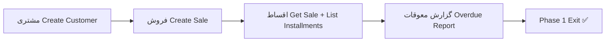

# TASK-123: Vertical Slice — Phase 1 E2E

## Metadata

| فیلد | مقدار |
|------|--------|
| Phase | 1 |
| Epic | Epic-15-Phase1-Vertical-Slice |
| ID | TASK-123 |
| Priority | P0 |
| Depends on | TASK-060–122 |
| Blocks | Phase 2 |
| Estimated | 12h |

---

## هدف

تأیید end-to-end که **تمام** قطعات Phase 1 با هم کار می‌کنند — exit criteria از `operational-phases.md` §فاز ۱:

> **مشتری → فروش → اقساط → گزارش معوقات**

HTTP E2E spec با NestJS app کامل + PostgreSQL/Redis واقعی. Playwright UI E2E documented as P1 stretch (not blocking Phase 1 exit).

---

## معیار پذیرش

- [ ] **HTTP E2E spec:** `apps/api/src/vertical-slice/phase1-vertical-slice.http.e2e.spec.ts`
- [ ] **Integration spec (optional):** `packages/application/src/vertical-slice/phase1-vertical-slice.integration.spec.ts`
- [ ] Flow uses `demo-shop` seed from Phase 0 (owner login)
- [ ] Step 1 — **مشتری:** POST `/api/v1/customers` → 201
- [ ] Step 2 — **فروش:** POST `/api/v1/sales` with Idempotency-Key → 201 + N installments
- [ ] Step 3 — **اقساط:** GET `/api/v1/sales/:id` → installments array length = count; GET `/api/v1/installments?saleId=` → rows
- [ ] Step 4 — **گزارش معوقات:** mark installment overdue (manual DB update or test helper simulating daily job) → GET overdue report endpoint → installment appears with `daysOverdue > 0`
- [ ] BR-005 sum invariant asserted in flow
- [ ] Cross-tenant check in same spec (customer A invisible to tenant B)
- [ ] RBAC smoke: viewer cannot create sale
- [ ] Tests with `describe.runIf(hasDatabase)` — real PG + Redis
- [ ] `pnpm turbo build && pnpm turbo test` pass
- [ ] Phase 1 README exit criteria checklist satisfied when this task Done

---

## مشخصات فنی

### HTTP E2E Path

```
apps/api/src/vertical-slice/phase1-vertical-slice.http.e2e.spec.ts
```

### Full Exit Flow (operational-phases.md)



### Step-by-Step HTTP Flow

```
Prerequisites: demo-shop tenant seeded (Phase 0), installments module enabled

1. POST /api/v1/auth/otp/request
   { phone: '09120000000', actor: 'staff', intent: 'login', tenantSlug: 'demo-shop' }

2. Redis: read OTP code

3. POST /api/v1/auth/otp/verify → accessToken (owner, all scope)

4. POST /api/v1/customers
   { phone: '09129998877', name: 'مشتری تست فاز ۱' }
   → 201 { id: customerId }

5. GET /api/v1/customers
   → 200 includes customerId

6. POST /api/v1/sales
   Headers: Idempotency-Key: uuid
   {
     tenantCustomerId: customerId,
     branchId: demoBranchId,
     title: 'فروش تست E2E',
     totalAmountRial: '12000000',
     downPaymentRial: '2000000',
     installmentCount: 4,
     firstDueDate: 'YYYY-MM-DD',  // +30 days from today
     contractDate: 'YYYY-MM-DD'
   }
   → 201 { id: saleId, installments: [4 items] }

7. Assert: sum(installments.amountRial) + downPayment === totalAmountRial

8. GET /api/v1/sales/:saleId
   → 200 installments.length === 4

9. GET /api/v1/installments?saleId=:saleId
   → 200 data.length === 4

10. Simulate overdue:
    - Test helper: UPDATE installment SET status='overdue', due_date=past
    - OR call internal test-only endpoint if exists
    - OR scheduler job stub in test setup

11. GET /api/v1/reports/overdue  (or GET /api/v1/installments?status=overdue)
    → 200 includes overdue installment, daysOverdue >= 1
    → meta.totalOutstandingRial > 0

12. Cross-tenant (same spec):
    - Login tenant B staff
    - GET /api/v1/sales/:saleId → 404 SALE_NOT_FOUND

13. RBAC smoke:
    - Login viewer role
    - POST /api/v1/sales → 403 PERMISSION_DENIED
```

### Integration Variant (Use Cases Direct)

```typescript
// packages/application/src/vertical-slice/phase1-vertical-slice.integration.spec.ts
// Same flow without HTTP — faster CI option
await createCustomerUseCase.execute(...);
const sale = await createSaleUseCase.execute(...);
const installments = await listInstallmentsUseCase.execute({ saleId: sale.id });
const overdue = await listOverdueInstallmentsUseCase.execute(...);
```

### Overdue Simulation Helper

```typescript
async function markInstallmentOverdueForTest(
  prisma: PrismaService,
  installmentId: string,
  tenantId: string,
): Promise<void> {
  const pastDue = subDays(new Date(), 7);
  await prisma.installment.update({
    where: { id: installmentId, tenantId },
    data: {
      status: 'overdue',
      dueDate: pastDue,
    },
  });
}
```

> Production: `pending → overdue` via daily scheduler job. Test bypasses job for determinism.

---

## فایل‌ها

| عمل | مسیر |
|-----|------|
| Create | `apps/api/src/vertical-slice/phase1-vertical-slice.http.e2e.spec.ts` |
| Create | `packages/application/src/vertical-slice/phase1-vertical-slice.integration.spec.ts` |
| Create | `apps/api/src/test-utils/overdue-test.helper.ts` |
| Reference | `Phases/Phase-0-Foundation/Epic-10-Vertical-Slice/TASK-054-vertical-slice-e2e.md` |

---

## مراحل پیاده‌سازی

1. Copy `createApp()` helper from Phase 0 HTTP E2E
2. Implement `loginDemoShopOwner()` helper
3. Implement main flow: customer → sale → installments
4. Implement overdue simulation helper
5. Assert overdue report endpoint
6. Add cross-tenant + RBAC smoke in same spec
7. Optional: integration spec without HTTP
8. Document Playwright stretch in comment (P1 — TASK future)

---

## Edge Cases Tested

| سناریو | تست |
|--------|-----|
| Duplicate Idempotency-Key on sale | 201 cached — same saleId |
| Customer list before/after create | count increases |
| Overdue report empty before mark | total=0 |
| Overdue report after mark | includes installment |
| Cross-tenant sale access | 404 |
| Viewer create sale | 403 |
| Cancelled sale installments in overdue | excluded |

---

## تست

- [ ] HTTP E2E: full flow مشتری → فروش → اقساط → گزارش معوقات
- [ ] HTTP E2E: BR-005 sum invariant
- [ ] HTTP E2E: cross-tenant isolation
- [ ] HTTP E2E: RBAC viewer deny create
- [ ] Integration (optional): same flow via use cases
- [ ] CI: `describe.runIf(hasDatabase)` with Testcontainers

---

## UX (P1 Stretch — not blocking)

- [ ] Playwright: `apps/web/e2e/phase1-seller-panel.spec.ts` — login → create customer → create sale → view overdue report page
- Documented as stretch goal; HTTP E2E is P0 exit gate

---

## Flow

```
Entry: demo-shop owner login (OTP)
  ↓ Create customer (مشتری)
  ↓ Create sale with installments (فروش)
  ↓ Verify installments via GET sale + list (اقساط)
  ↓ Mark overdue + GET overdue report (گزارش معوقات)
  ↓ Cross-tenant + RBAC checks
Exit: Phase 1 complete — operational-phases.md §فاز ۱ Exit ✅
```

---

## Policy Alignment

- [ ] operational-phases.md §فاز ۱ Exit — exact flow match
- [ ] EXCELLENCE-STANDARDS §9 — vertical slice required
- [ ] testing-observability.md §9 — real infra, no mocks
- [ ] SOFT-DELETE-POLICY — no hard delete in flow
- [ ] ADR-007, ADR-013, ADR-015 — exercised in flow

---

## Phase 1 Exit Checklist (this task validates)

- [ ] All P0 tasks TASK-060–122 implemented
- [ ] E2E: مشتری → فروش → اقساط → گزارش معوقات
- [ ] Integration: CreateSale + RBAC + cross-tenant pass
- [ ] Domain: BR-005 + state transitions pass (TASK-118, 119)
- [ ] CI grep: no `prisma.*.delete()` on business models
- [ ] `@RequireModule('installments')` on module endpoints

---

## مراجع

- `docs/07-roadmap/operational-phases.md` §فاز ۱ Exit
- `docs/06-operations/testing-observability.md` §9
- `Phases/Phase-0-Foundation/Epic-10-Vertical-Slice/TASK-054-vertical-slice-e2e.md`
- `Phases/Phase-1-Seller-Panel/README.md` — Exit Criteria
- `Phases/Phase-1-Seller-Panel/Epic-05-Installments-Use-Cases/TASK-077-usecase-list-overdue-installments.md`

---

## Self-Review Score

| محور | سقف | امتیاز | یادداشت |
|------|-----|--------|---------|
| Metadata | 10 | 10 | Depends TASK-060–122 |
| Completeness | 25 | 25 | Full exit flow، checklist |
| Policy | 25 | 25 | operational-phases exit |
| Executability | 25 | 25 | 13 HTTP steps، helpers |
| Alignment | 15 | 15 | TASK-054 pattern، TASK-077 |
| **جمع** | **100** | **100** | ≥95 ✅ |
