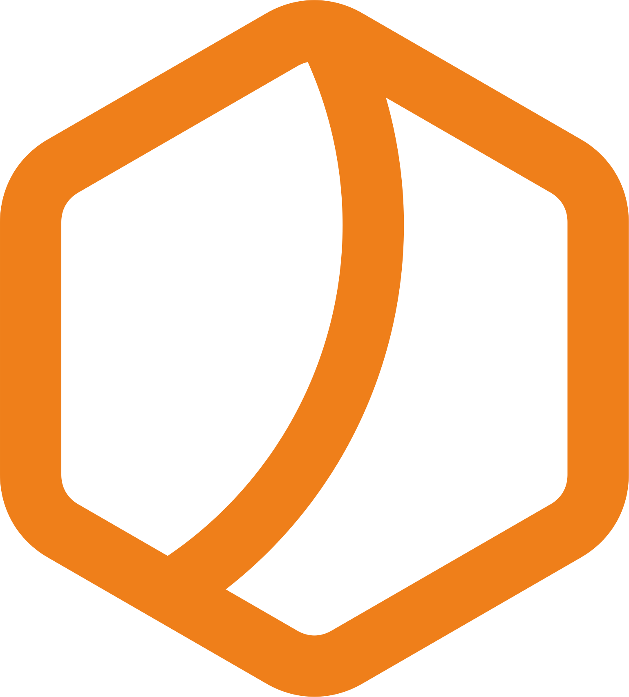

<div align="center">



# Hivork

**Modular SaaS platform for Iranian retail — starting with installment management**

پلتفرم SaaS ماژولار برای خرده‌فروشی ایران — ماژول اول: **مدیریت اقساط**

[](https://github.com/tiam-mhd/Hivork/actions/workflows/ci.yml)


[فارسی](#فارسی) · [English](#english) · [Docs](./docs/README.md) · [Roadmap](./docs/07-roadmap/development-roadmap.md)

</div>

---

## فارسی

### Hivork چیست؟

**Hivork** یک پلتفرم **چندمستأجری (multi-tenant)** برای فروشگاه‌های خرده‌فروشی ایران است. هسته مشترک (احراز هویت، RBAC، تنظیمات، audit) روی آن ماژول‌های افزایشی سوار می‌شوند. **ماژول اول: مدیریت فروش و اقساط.**

| قابلیت | توضیح |
|--------|--------|
| فروش قسطی | ثبت فروش، تقسیم اقساط، تقویم شمسی |
| مدیریت مشتری | CRUD مشتری tenant، تگ، import |
| پرداخت | ثبت توسط مشتری، تأیید/رد توسط فروشنده |
| RBAC | نقش‌ها، مجوزها، data scope (all / branch / own) |
| اعلان | یادآور اقساط از طریق ربات (تلگرام / بله) |
| Audit | لاگ تغییرات حساس — append-only |

### معماری

```
┌─────────────────────────────────────────────────────────┐
│  Channels: Web (Next.js) · Bot Gateway · Scheduler      │
├─────────────────────────────────────────────────────────┤
│  API (NestJS) — Auth · RBAC · Modules · Guards          │
├─────────────────────────────────────────────────────────┤
│  Application (Use Cases) ← Domain (Business Rules)      │
├─────────────────────────────────────────────────────────┤
│  Infrastructure — Prisma · Redis · BullMQ · Outbox      │
└─────────────────────────────────────────────────────────┘
```

**Modular Monolith** با Clean Architecture — business logic فقط در `packages/domain` و `packages/application`.

### شروع سریع

**پیش‌نیاز:** Node.js ≥ 20 · pnpm ≥ 9 · Docker Desktop

```bash
git clone https://github.com/tiam-mhd/Hivork.git
cd Hivork
pnpm install
cp .env.example .env
pnpm docker:up
pnpm db:migrate
pnpm db:seed
pnpm dev
```

| سرویس local | آدرس |
|-------------|------|
| PostgreSQL 16 | `localhost:5432` |
| Redis 7 | `localhost:6379` |
| Mailhog UI | http://localhost:8025 |

### ساختار monorepo

```
apps/           api · web · bot-gateway · scheduler
packages/       domain · application · infrastructure · contracts · ui · theme · i18n
modules/        core · installments
prisma/         schema · migrations · seed
docs/           معماری · محصول · ADR · قوانین توسعه
Phases/         task specs فازبندی
```

### مستندات کلیدی

- [فهرست مستندات](./docs/README.md)
- [معماری کلان](./docs/02-architecture/overview.md)
- [RBAC](./docs/02-architecture/rbac.md)
- [ماژول اقساط](./docs/03-modules/installments/domain.md)
- [قوانین توسعه](./docs/09-development/DEVELOPMENT_RULES.md)
- [AGENTS.md](./AGENTS.md) — دستورالعمل AI agent / توسعه‌دهنده

---

## English

### What is Hivork?

**Hivork** is a **multi-tenant modular SaaS** for Iranian retail businesses. A shared core (auth, RBAC, settings, audit) powers pluggable modules. **Module 1: installment sales management.**

### Tech stack

| Layer | Technology |
|-------|------------|
| Monorepo | pnpm workspaces + Turborepo |
| API | NestJS · Zod contracts |
| Web | Next.js · RTL · Tailwind |
| Database | PostgreSQL 16 · Prisma |
| Cache / Queue | Redis 7 · BullMQ |
| Auth | Phone OTP · JWT (staff / customer actors) |
| Testing | Vitest · Testcontainers · Playwright |

### Development commands

```bash
pnpm dev              # start all apps in dev mode
pnpm build            # production build
pnpm lint             # ESLint across monorepo
pnpm typecheck        # TypeScript strict check
pnpm test             # unit + integration tests
pnpm format           # Prettier write
pnpm ci:hard-delete-check   # ADR-013 guard — no hard delete
```

### CI pipeline

GitHub Actions runs on every push/PR:

- Format check · hard-delete guard · Prisma validate
- Lint · typecheck · test · build
- PostgreSQL 16 + Redis 7 service containers

### Project principles

- **Soft delete only** on business data (ADR-013) — no `prisma.delete()` on entities
- **Tenant isolation** — every query scoped by `tenantId`
- **Money as `bigint` rials** — never float/number
- **RBAC on every staff endpoint** — permission + module + data scope
- **Audit log** on sensitive operations — immutable, append-only

---

## Contributing

This is a private product repository. See [DEVELOPMENT_RULES.md](./docs/09-development/DEVELOPMENT_RULES.md) and [BRANCHING-STRATEGY.md](./docs/09-development/BRANCHING-STRATEGY.md) before opening a PR.

Commit format: `type(scope): description` — e.g. `feat(installments): add create sale`

---

## Author

**[tiam-mhd](https://github.com/tiam-mhd)** · tiam.mhd76@gmail.com

---

<div align="center">
<sub>Built with ❤️ for Iranian retail · ۱۴۰۵</sub>
</div>
