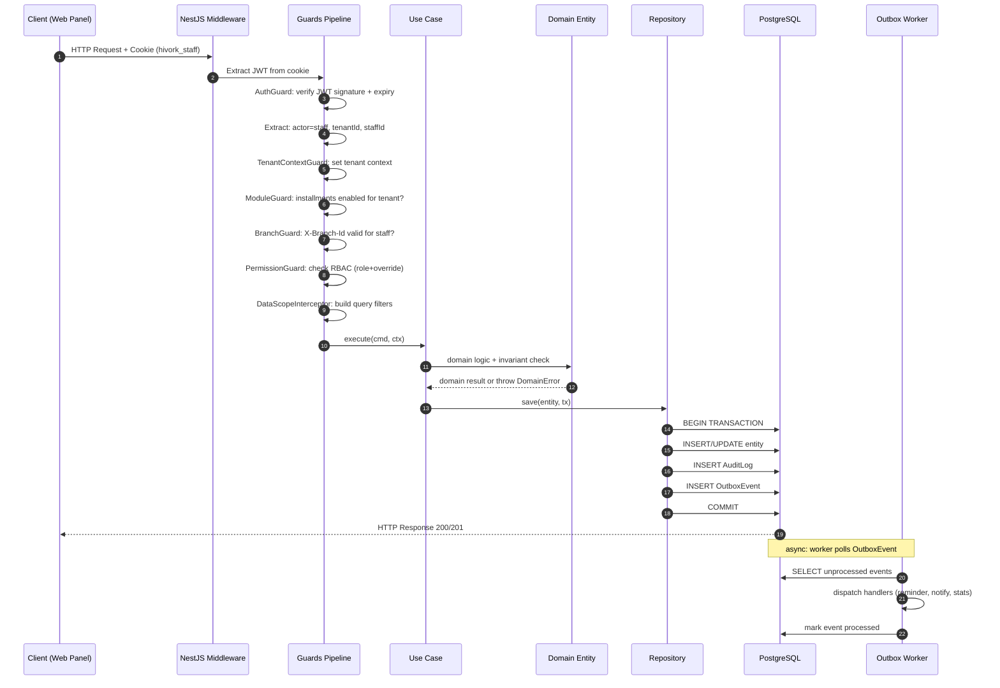
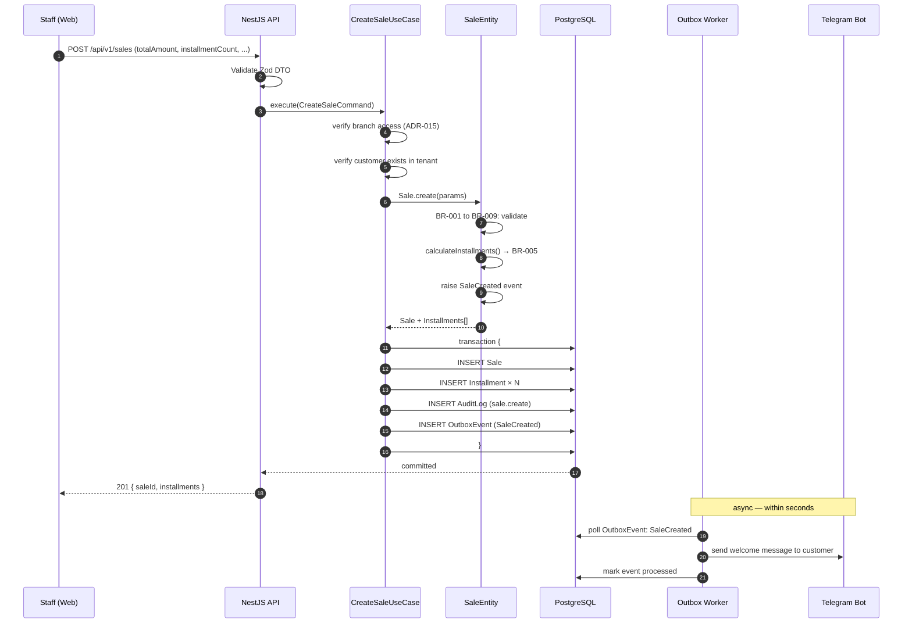
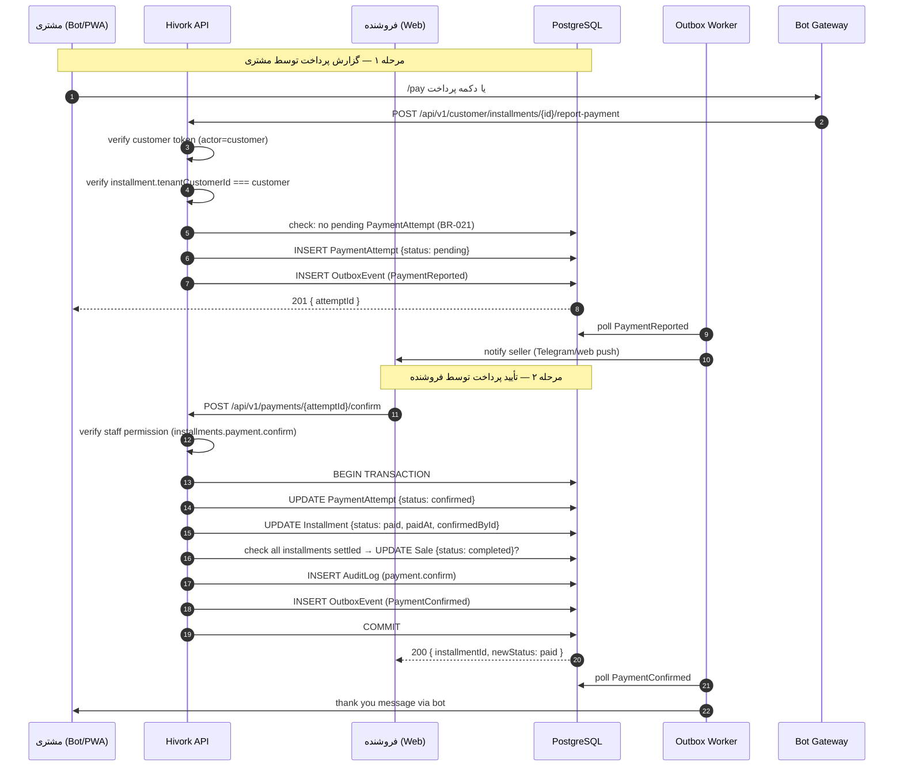
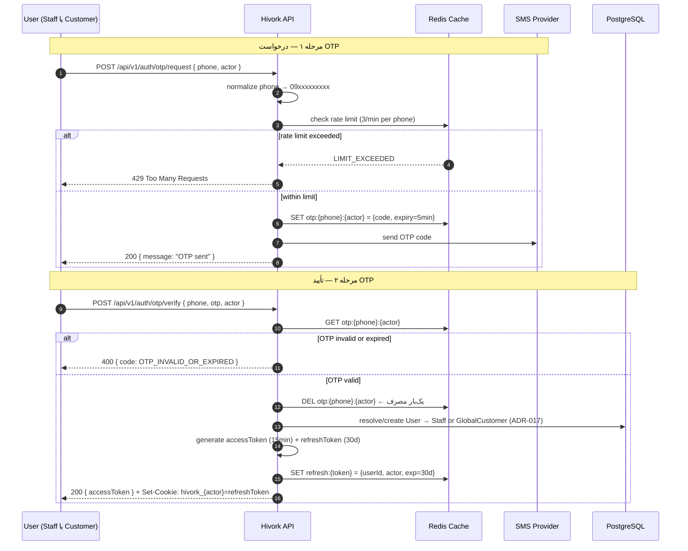
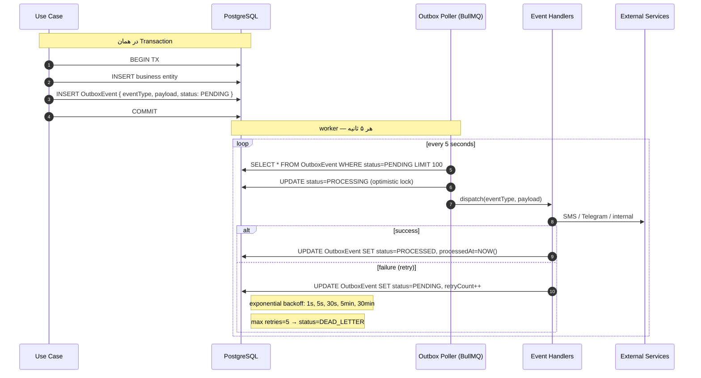
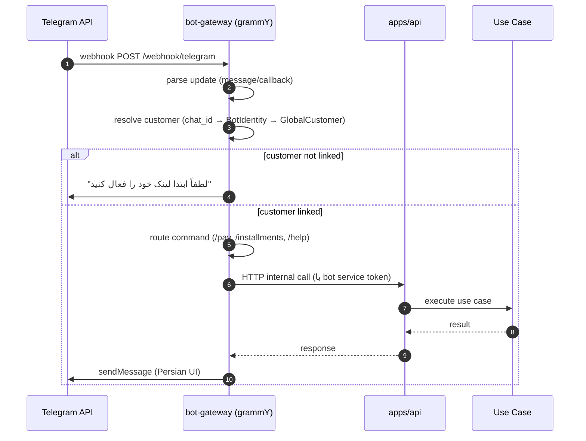
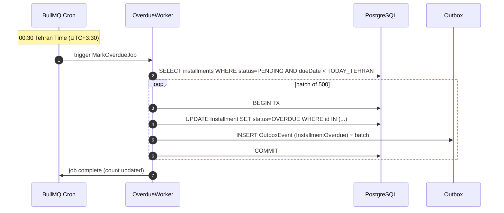
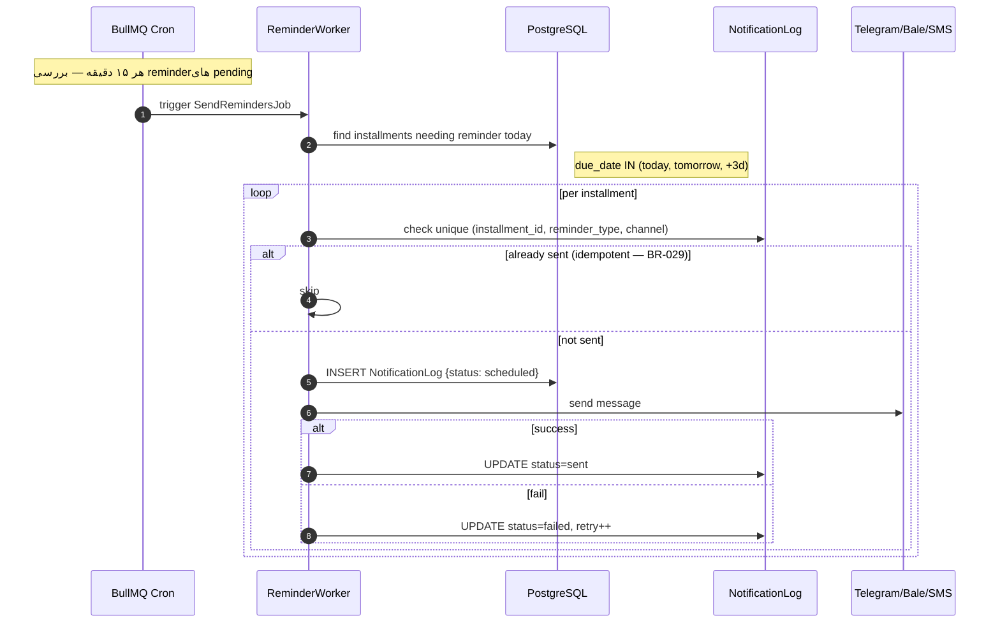

# Data Flow — Hivork

> **وضعیت:** Approved — v1.0  
> **نسخه:** 1.0 — 1405/04/08  
> **ADR مرتبط:** ADR-003, ADR-008, ADR-010, ADR-015  
> **مراجع:**
> - [Architecture Overview](./overview.md)
> - [API Contracts](./api-contracts.md)
> - [RBAC](./rbac.md)

---

## ۱. جریان کلی درخواست HTTP — Staff

هر درخواست HTTP از کاربر (web panel) به API سرور از این pipeline عبور می‌کند:



---

## ۲. جریان ایجاد فروش — CreateSale



---

## ۳. جریان گزارش و تأیید پرداخت



---

## ۴. جریان OTP Login



---

## ۵. جریان Outbox Pattern

جریان کامل event-driven با at-least-once delivery:



### OutboxEvent Schema

```typescript
OutboxEvent {
  id: UUID
  eventType: string         // 'SaleCreated' | 'PaymentConfirmed' | ...
  payload: JSON             // { saleId, tenantId, ... }
  status: 'PENDING' | 'PROCESSING' | 'PROCESSED' | 'DEAD_LETTER'
  retryCount: number        // 0-5
  processedAt: DateTime?
  deadAt: DateTime?
  createdAt: DateTime
  tenantId: UUID?           // for monitoring
}
```

### Event → Handler Mapping

| Event | Handlers |
|-------|---------|
| `SaleCreated` | SendWelcomeMessage, LogAudit |
| `InstallmentDueSoon` | SendReminder (BR-029) |
| `InstallmentOverdue` | SendOverdueReminder, NotifySeller |
| `PaymentReported` | NotifySeller |
| `PaymentConfirmed` | ThankCustomer, UpdateStats |
| `PaymentRejected` | NotifyCustomerRejection |
| `CustomerLinkedToBot` | EnableReminders, SendWelcome |
| `SaleCompleted` | NotifyCompletion, UpdateStats |

---

## ۶. جریان Bot Gateway



---

## ۷. جریان Scheduler — Daily Overdue Job



---

## ۸. جریان Reminder Scheduler



---

## ۹. لایه‌بندی داده و مسئولیت‌ها

```
┌──────────────────────────────────────────────────────────┐
│                  Presentation Layer                       │
│  NestJS Controllers, Zod Validation, Guards, Response DTO│
│  Bot Handlers (grammY), Scheduler Jobs                   │
└────────────────────────┬─────────────────────────────────┘
                         │ Commands / Queries
┌────────────────────────▼─────────────────────────────────┐
│                  Application Layer                        │
│  Use Cases: CreateSale, ConfirmPayment, WaiveInstallment │
│  DTOs, Event Dispatch, Orchestration (no business logic) │
└────────────────────────┬─────────────────────────────────┘
                         │ Entity Methods / Domain Events
┌────────────────────────▼─────────────────────────────────┐
│                    Domain Layer                           │
│  Entities: Sale, Installment, PaymentAttempt             │
│  Value Objects: Money (BigInt Rial), PhoneNumber         │
│  Domain Events: SaleCreated, PaymentConfirmed, ...       │
│  Domain Services: InstallmentCalculator                  │
│  Invariants: BR-001 → BR-047                             │
└────────────────────────┬─────────────────────────────────┘
                         │ Repository Interfaces
┌────────────────────────▼─────────────────────────────────┐
│                Infrastructure Layer                       │
│  Prisma Repository (PG): auto-append tenantId filter     │
│  Redis: OTP, sessions, rate limits, branch sessions      │
│  Notification: Telegram (grammY), Bale, SMS (Kavenegar) │
│  File Storage: Arvan S3 (evidence files)                 │
│  Outbox Poller (BullMQ)                                  │
└──────────────────────────────────────────────────────────┘
```

---

## ۱۰. Multi-Tenancy در Query Layer

هر repository call به صورت اتوماتیک `tenantId` filter اعمال می‌کند:

```typescript
// packages/infrastructure/persistence/sale.repository.ts
export class SaleRepository {
  async findById(id: string, tenantId: string): Promise<Sale | null> {
    const raw = await this.prisma.sale.findFirst({
      where: {
        id,
        tenantId,      // ← همیشه از JWT، هرگز از client
        deletedAt: null,
      },
    });
    return raw ? SaleMapper.toDomain(raw) : null;
  }

  async findAll(query: SaleQuery, ctx: TenantContext): Promise<Sale[]> {
    return this.prisma.sale.findMany({
      where: {
        tenantId: ctx.tenantId,            // mandatory
        ...(ctx.branchIds && {
          branchId: { in: ctx.branchIds }, // data scope
        }),
        deletedAt: null,
        ...(query.status && { status: query.status }),
      },
      orderBy: { createdAt: 'desc' },
      take: query.limit ?? 20,
      cursor: query.cursor ? { id: query.cursor } : undefined,
    });
  }
}
```

---

*نسخه 1.0 — 1405/04/08*
