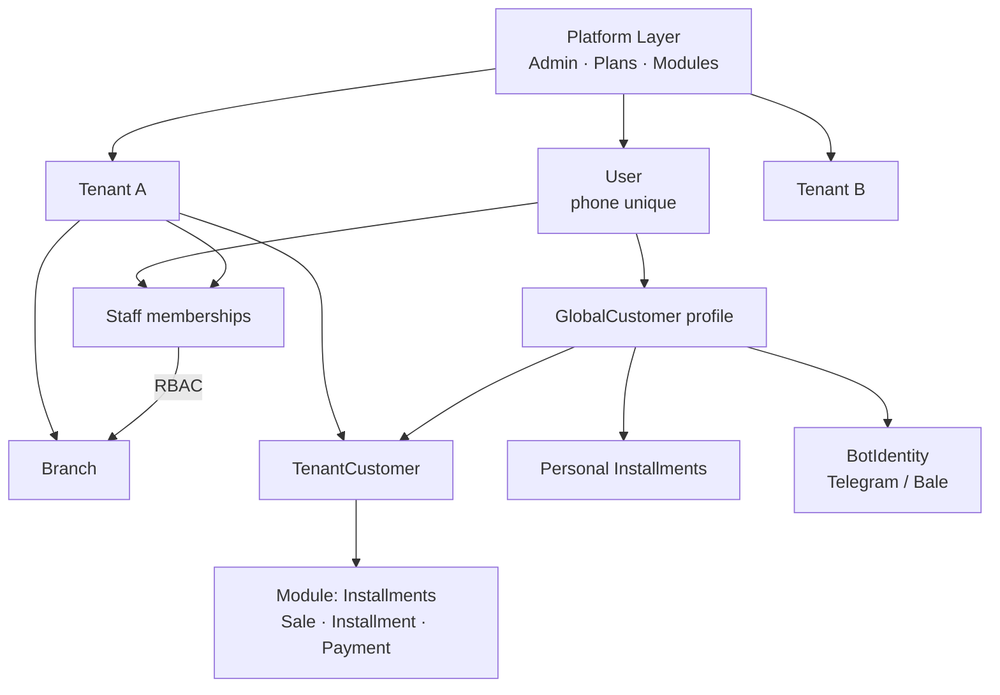
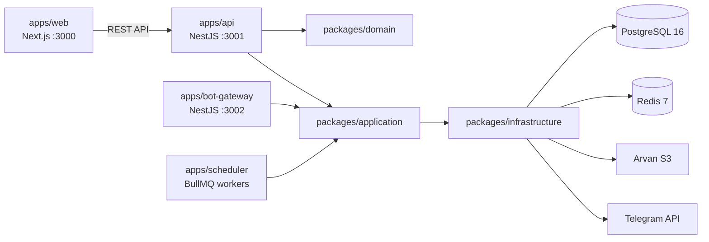
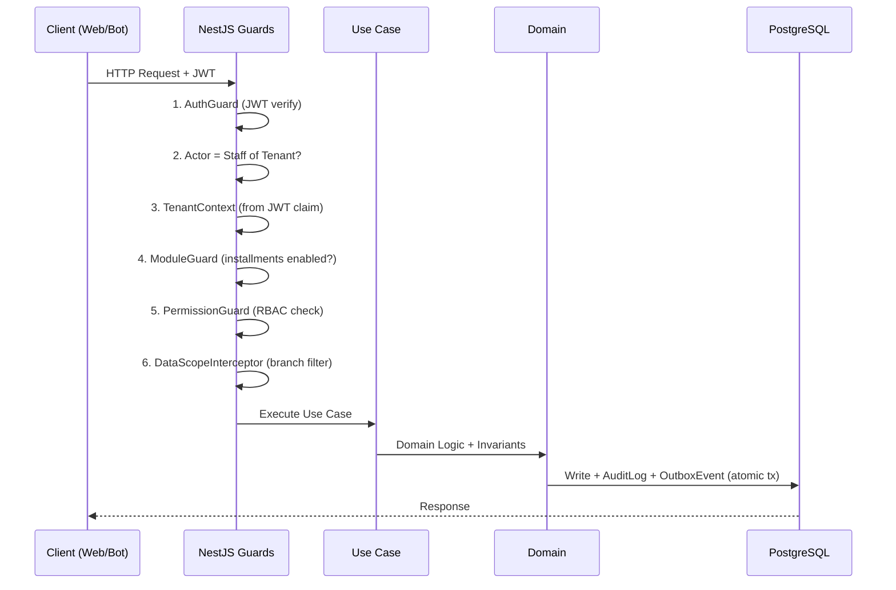

# معماری کلان — Hivork

> **وضعیت:** Approved — v1.0  
> **نسخه:** 1.0 — 1405/04/08  
> **ADR مرتبط:** ADR-003, ADR-010, ADR-013, ADR-015, ADR-017  

## فلسفه

### Modular Monolith (نه Microservice از روز ۱)

```
سال ۱–۳: Modular Monolith + Workers جدا
سال ۵+:  Extract service (notification، payment) در صورت نیاز scale
```

Microservice برای **مقیاس تیم و ترافیک** است — نه برای «حرفه‌ای به نظر رسیدن».

### اصول ثابت ۱۰ ساله

| اصل | معنی عملی |
|-----|-----------|
| **API-first** | هر UI از API عمومی استفاده کند |
| **Event-driven داخلی** | `InstallmentDue` → reminder + report + audit |
| **Multi-tenant از روز ۱** | `tenant_id` روی همه queryها |
| **Clean Architecture** | Domain pure — بدون وابستگی framework |
| **Channel-agnostic** | Bot، Web، PWA همه thin client |
| **Idempotent notifications** | یک قسط = یک یادآور per channel/type |

---

## دیاگرام کلان



```
                    ┌──────────────────────┐
                    │   Platform Layer     │
                    │ Admin, Plans, Modules│
                    └──────────┬───────────┘
                               │
              ┌────────────────┼────────────────┐
              ▼                ▼                ▼
         ┌─────────┐     ┌───────────┐   ┌─────────────┐
         │ Tenant A│     │ Tenant B  │   │GlobalCustomer│
         └────┬────┘     └─────┬─────┘   └──────┬──────┘
              │                │                 │
    ┌─────────┼─────────┐      │          Personal installments
    ▼         ▼         ▼      │          Bot identity
 Branch    Staff      TenantCustomer
    │         │              │
    │    Roles+Perms         │
    │    DataScope           │
    └─────────┬──────────────┘
              ▼
      ┌───────────────┐
      │ Module:       │
      │ Installments  │
      │ Sale, Inst... │
      └───────────────┘
```

---

## لایه‌های Runtime



```
┌─────────────┐     ┌─────────────┐     ┌─────────────┐
│  apps/api   │     │ bot-gateway │     │ scheduler   │
│  (HTTP API) │     │ (webhooks)  │     │ (jobs)      │
└──────┬──────┘     └──────┬──────┘     └──────┬──────┘
       │                   │                   │
       └───────────────────┼───────────────────┘
                           ▼
              packages/domain + application
                           ▼
              packages/infrastructure
                           ▼
                    PostgreSQL + Redis
```

| App | مسئولیت |
|-----|---------|
| `api` | REST HTTP، auth، business use cases |
| `bot-gateway` | Telegram/Bale webhooks → use cases |
| `scheduler` | cron، delayed jobs (BullMQ) |
| `web` | Next.js — seller panel، customer portal، marketing |

---

## Clean Architecture (Backend)

```
Request (HTTP / Bot / Job)
        ↓
   Presentation Layer     ← Controllers, Bot handlers, DTO (Zod)
        ↓
   Application Layer      ← Use Cases, Commands, Queries
        ↓
   Domain Layer           ← Entities, Value Objects, Domain Events
        ↓
   Infrastructure         ← Prisma, Redis, SMS, Bot adapters
```

**قانون:** Domain Logic **هرگز** در Controller یا Bot handler نماند.

---

## Request Flow (Staff)



```
1. Authenticate (JWT)
2. Resolve Actor → Staff of Tenant?
3. Resolve Tenant Context (claim / header / subdomain)
4. Check Module Enabled (installments in plan?)
5. Check Permission (role + user override)
6. Apply Data Scope Filter on Query
7. Execute Use Case
8. Audit Log (if sensitive)
9. Publish Domain Event → Outbox
```

---

## Event-Driven (Outbox Pattern)

```
Use Case + DB Transaction (atomic)
        ↓
   Domain Event → outbox table
        ↓
   Worker consumes → handlers:
        - SendReminder
        - NotifySeller
        - UpdateStats
        - Audit
```

Events **at-least-once** — handlers باید idempotent باشند.

---

## سه لایه «قابل تنظیم بودن»

| لایه | قابل تغییر؟ | مثال |
|------|-------------|------|
| **Invariant Rules** | ❌ | قسط paid بدون audit حذف نشود |
| **Tenant/Branch Settings** | ✅ | روزهای یادآور، ساعت ارسال |
| **Authorization (RBAC)** | ✅ | role، permission override |
| **Feature / Module Flags** | ✅ | ماژول اقساط فعال؟ |

> **تأیید شده:** تنظیمات = پارامترهای از پیش تعریف‌شده (schema) — نه هر rule business دلخواه.

---

## مراجع

- [Multi-Tenancy و موجودیت‌ها](./tenancy-and-entities.md)
- [سیستم RBAC](./rbac.md)
- [قراردادهای API](./api-contracts.md)
- [ماژول اقساط](../03-modules/installments/domain.md)
- [ADR-003: Modular Monolith](../08-decisions/adr-log.md)

---

*نسخه 1.0 — 1405/04/08*
