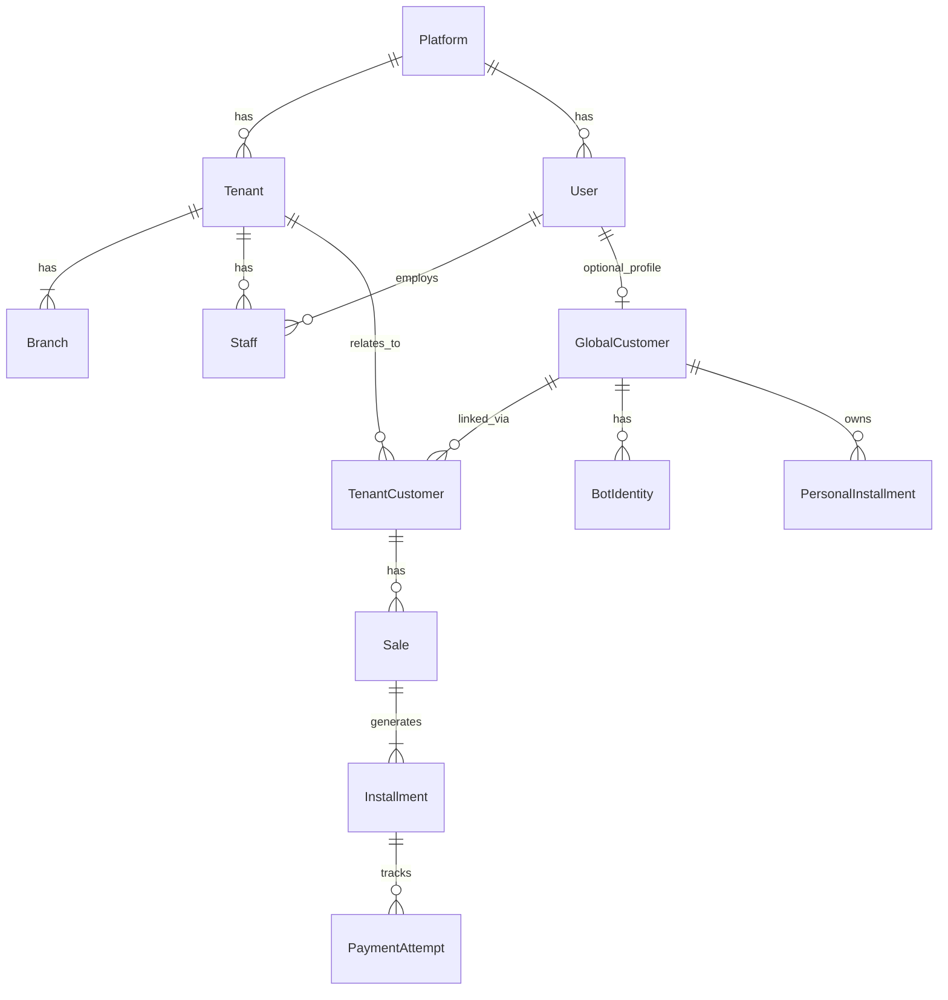

# Multi-Tenancy و مدل موجودیت‌ها — Hivork

> **وضعیت:** Approved — v1.1  
> **نسخه:** 1.1 — 1405/04/09  
> **ADR مرتبط:** ADR-002, ADR-009, ADR-013, ADR-015, ADR-017  

## استراتژی Multi-Tenancy

**Shared Database + `tenant_id` روی همه جداول tenant-scoped**

```sql
SELECT * FROM installments
WHERE tenant_id = $current_tenant AND ...
```

- Prisma middleware / `$extends` برای inject خودکار `tenantId` از JWT
- Defense in depth: PostgreSQL RLS (فاز ۲+)
- یک باگ بدون filter = leak داده = پایان محصول

---

## فیلدهای پایه (EXCELLENCE §2)

**هر جدول business** این فیلدها را دارد:

| فیلد | توضیح |
|------|--------|
| id | UUID |
| createdAt / updatedAt | timestamptz |
| createdById / updatedById | UUID? FK |
| deletedAt / deletedById | soft delete — **اجباری** |
| deleteReason | optional |
| version | optimistic lock |
| metadata | Json? extensibility |

**استثنا — append-only (بدون soft delete):** `AuditLog`, `OutboxEvent`

**روابط:** `onDelete: Restrict` یا `SetNull` — **هرگز Cascade hard delete** (ADR-013)

---

## Soft Delete (ADR-013)

| قانون | |
|-------|---|
| Hard delete | ❌ ممنوع در application |
| Query default | `deletedAt: null` — Prisma extension (TASK-046) |
| Restore | tenant owner / platform admin — audit log |
| UI | کاربر عادی deleted را نمی‌بیند — 404 |

مرجع: `docs/09-development/SOFT-DELETE-POLICY.md`

---

## سلسله موجودیت‌ها (تأیید شده)

### ❌ مدل اشتباه

```
Tenant → Branch → Customer   (Customer زیر Branch نیست)
```

### ✅ مدل صحیح (ADR-017)

```
Platform
├── PlatformUser              # تیم Hivork (جدا از User)
├── User                      # هویت platform — phone unique
│   ├── Staff[]               # عضویت B2B per tenant (userId + tenantId unique)
│   └── GlobalCustomer?       # پروفایل B2C اختیاری (1:1 با User)
├── Tenant                    # مشترک SaaS
├── ModuleRegistry / Plan
└── GlobalCustomer            # پروفایل مشتری — FK به User (نه phone مستقیم)

Tenant
├── Branch[]                  # حداقل ۱ — default «شعبه اصلی» auto-create
├── Staff[]                   # userId → User
└── TenantCustomer[]          # رابطه tenant ↔ GlobalCustomer (نه User)

GlobalCustomer
├── userId (unique — 1:1 با User)
├── bot_identities
└── personal_installments[]   # اقساط شخصی (ماژول ۱)
```

**قوانین کلیدی:**
- `phone` فقط روی `User` — Staff/GlobalCustomer از join می‌خوانند
- یک User می‌تواند Staff در **چند tenant** باشد (multi-tenant owner/staff)
- `TenantCustomer` **هرگز** مستقیم به `User` وصل نمی‌شود — فقط `GlobalCustomer`
- Staff و Customer actor جدا — session/token جدا (ADR-011)

---

## Platform Layer

### PlatformUser

| فیلد | توضیح |
|------|--------|
| id | UUID |
| phone / email | unique |
| name | |
| role | `super_admin`, `support` |
| status | active, suspended |
| lastLoginAt | |
| + base fields | soft delete enabled |

---

## Tenant

| فیلد | توضیح |
|------|--------|
| id | UUID |
| name, slug | نام + URL-safe slug |
| legalName, taxId | optional |
| phone, email, address | optional |
| status | trial, active, suspended |
| statusReason | |
| planId | entitlement ماژول‌ها |
| trialEndsAt, suspendedAt | |
| enabledModules | `['installments', ...]` |
| timezone, locale | |
| onboardingCompletedAt | |
| + base fields | soft delete (platform admin) |

**Default Branch:** tenant تازه‌ثبت → خودکار `شعبه اصلی`.  
UI شعبه برای تک‌شعبه‌ای‌ها ساده/پنهان.

---

## Branch

| فیلد | توضیح |
|------|--------|
| id | UUID |
| tenant_id | FK |
| name | |
| address | optional |
| is_default | boolean |
| branch_settings | override محدود روی tenant settings |

---

## User (Platform Identity — ADR-017)

| فیلد | توضیح |
|------|--------|
| id | UUID |
| phone | **unique platform-wide** — canonical OTP/login identity |
| name | optional display name |
| status | active, suspended |
| lastLoginAt | |
| + base fields | soft delete enabled |

**روابط:**
- `Staff[]` — zero or more tenant memberships (B2B)
- `GlobalCustomer?` — optional B2C profile (max one per user)

**Auth:** OTP verify → resolve/create `User` → branch to Staff login or GlobalCustomer login by `actor`.

---

## Staff (Tenant Membership — B2B Actor)

| فیلد | توضیح |
|------|--------|
| id | UUID |
| tenant_id | FK |
| user_id | FK → User (identity) |
| name | display name in tenant context |
| assigned_branch_ids | `[]` = همه شعب؛ هر UUID باید همان `tenant_id` باشد (validate در use case) |
| primary_branch_id | optional — شعبه پیش‌فرض UI؛ باید ∈ `assigned_branch_ids` یا وقتی `data_scope=all` و assign خالی است |
| roles | many-to-many |
| permission_overrides | grant/deny |
| data_scope | `all` \| `branch` \| `own` |
| status | active, suspended |

**Unique:** `(tenant_id, user_id)` — یک User یک Staff per tenant.

> Staff و GlobalCustomer می‌توانند **همان User/phone** داشته باشند — session و token جدا (ADR-011).

---

## GlobalCustomer (B2C Profile)

| فیلد | توضیح |
|------|--------|
| id | UUID |
| user_id | FK → User (**unique** — 1:1) |
| name | |
| status | active |

### BotIdentity

| فیلد | توضیح |
|------|--------|
| customer_id | FK |
| platform | `telegram` \| `bale` |
| external_id | chat_id |
| linked_at | |

---

## TenantCustomer (رابطه)

| فیلد | توضیح |
|------|--------|
| id | UUID |
| tenant_id | FK |
| global_customer_id | FK |
| localCode, tags | |
| notes, internalNotes | staff-only |
| defaultBranchId | optional |
| preferredContactChannel | telegram, bale, sms, phone |
| marketingOptIn | |
| creditScore, overdueCount | tenant-specific |
| totalPurchaseRial, lastPurchaseAt | bigint / timestamptz |
| + base fields | soft delete + restore (TASK-056) |

**Unique:** `(tenant_id, global_customer_id)`

---

## Subscription / Module Entitlement

```
Plan
├── code: 'starter' | 'pro' | 'enterprise'
├── modules: ['installments']
├── limits: { max_customers, max_staff, max_branches }
└── price_rial
```

Tenant بدون entitlement → API 403، menu مخفی.

---

## Data Scope (Staff)

| Scope | فیلتر Query |
|-------|-------------|
| `all` | `tenant_id = X` |
| `branch` | `+ branch_id IN effectiveBranchIds` (see below) |
| `own` | `+ created_by = staff_id` |

`effectiveBranchIds` = تقاطع `assigned_branch_ids` با **شعبه فعال session** (اگر set شده)؛ اگر session خالی → همه assign‌ها.

```typescript
const allowed = staff.assignedBranchIds.length
  ? staff.assignedBranchIds
  : allBranchIdsOfTenant; // empty assign = all
const active = session.activeBranchId;
const effective = active ? allowed.filter(id => id === active) : allowed;
// query: { branchId: { in: effective } }
```

مثال: `cashier` + `branch` + `installments.sale.create` → فقط شعبه(های) مجاز خودش.

---

## Branch — قوانین اجباری (از روز ۱)

> مرجع: ADR-009, ADR-015 · جلوگیری از refactor دیرهنگام multi-branch

### Staff ↔ Branch (نه FK تکی)

- Staff به **Tenant** وصل است (هویت، OTP، JWT).
- محدودیت شعبه: `assigned_branch_ids[]` + `data_scope` + `primary_branch_id` (UX).
- ❌ `staff.branch_id` تکی — owner/chief multi-branch را می‌شکند.

### شعبه فعال (Active Branch Session)

- **در JWT نیست** — tenant در token کافی است.
- Staff با چند شعبه: `PATCH /api/v1/staff/me/active-branch` یا header `X-Branch-Id`.
- Storage: Redis `staff:{id}:active_branch` (TTL = refresh) یا httpOnly cookie جدا.
- Guard: شعبه فعال باید `canAccessBranch()` pass کند؛ وگرنه `403 BRANCH_NOT_ALLOWED`.
- UI: branch switcher در shell پنل فروشنده؛ default = `primary_branch_id` ?? tenant default branch.

### رکوردهای branch-scoped (الزام schema)

هر رکورد **عملیاتی** که در گزارش/فیلتر شعبه‌ای است **باید** `branch_id NOT NULL` + FK به `branches`:

| جدول / Aggregate | فاز | Index اجباری |
|------------------|-----|----------------|
| `sales` | 1 (installments) | `@@index([tenantId, branchId])` |
| `payment_attempts` | 1 | inherit از sale یا `branch_id` denormalized |
| `tenant_customers.default_branch_id` | 0 | FK + validate same tenant |

`installments` می‌تواند `tenant_id` denormalized داشته باشد؛ `branch_id` از `sale` join می‌شود — در query/guard از sale.branch_id استفاده شود.

### Invariants

1. **یک** `is_default=true` per tenant (use case + test؛ partial unique index در migration TASK-027).
2. `assigned_branch_ids` — همه UUIDها belong to same tenant، branch فعال و not deleted.
3. `primary_branch_id` — null یا ∈ assigned؛ اگر assign خالی (`all` branches) → primary می‌تواند default tenant branch باشد.
4. `defaultBranchId` روی TenantCustomer — FK + same tenant.
5. Soft delete default branch → `DELETE_FORBIDDEN` (ADR-009).

### Validation (use case / domain)

```
assignBranches(ids) → each id exists, tenant match, not deleted
setPrimaryBranch(id) → canAccessBranch(id)
createSale(...) → branchId required; staff canAccessBranch(branchId)
```

---

## ER Diagram (خلاصه)



```
┌──────────┐       ┌──────────┐       ┌────────────────┐
│  Tenant  │──1:N──│  Branch  │       │ GlobalCustomer │
└────┬─────┘       └──────────┘       └───────┬────────┘
     │                                         │
     ├──1:N── Staff ──N:1── User ◄──1:1───────┘
     │              (phone unique)
     └──1:N── TenantCustomer ───N:1────────────┘
                    │
                    └── (via module) Sale → Installment
```

---

*نسخه 1.1 — 1405/04/09 — ADR-017 User identity*
