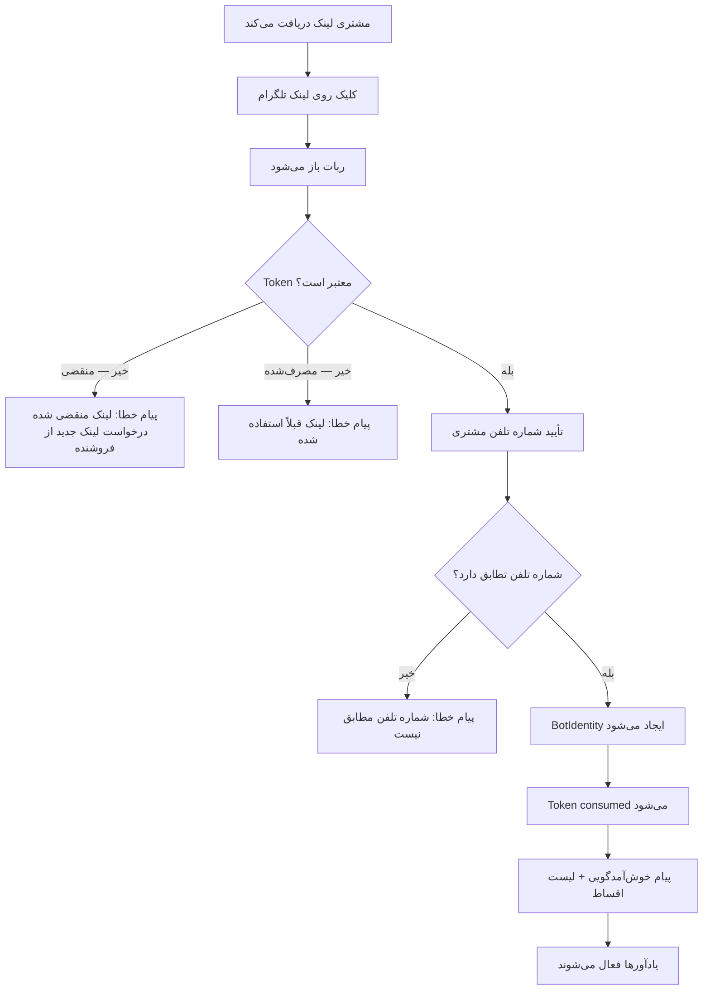
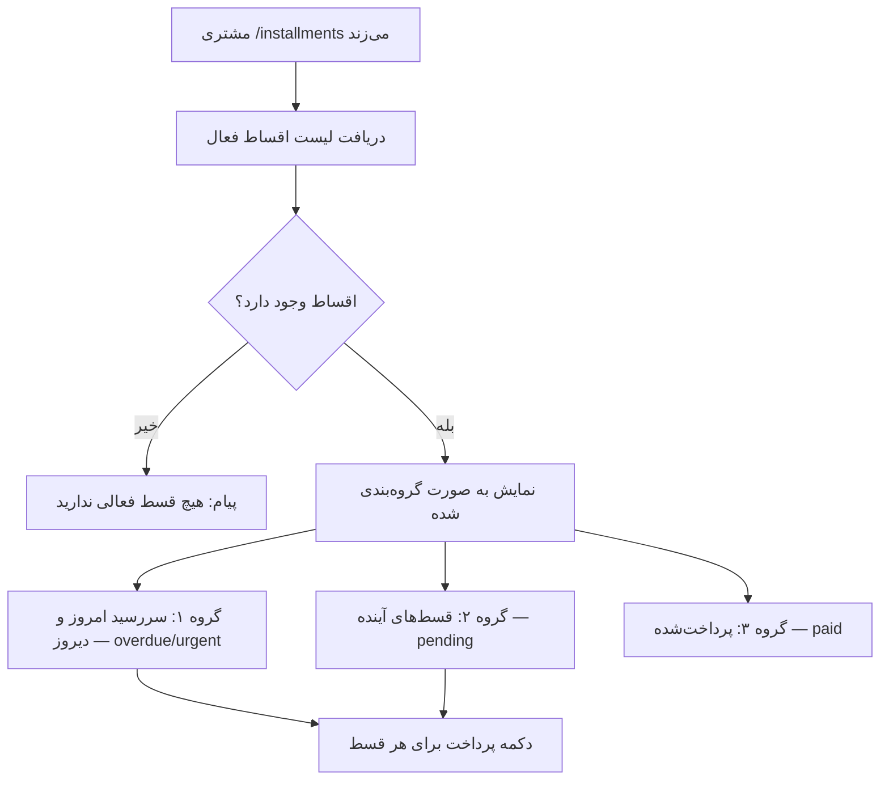
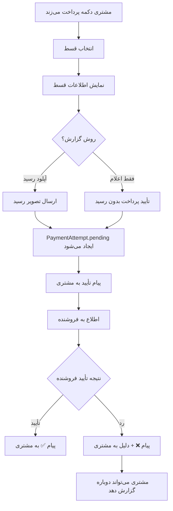
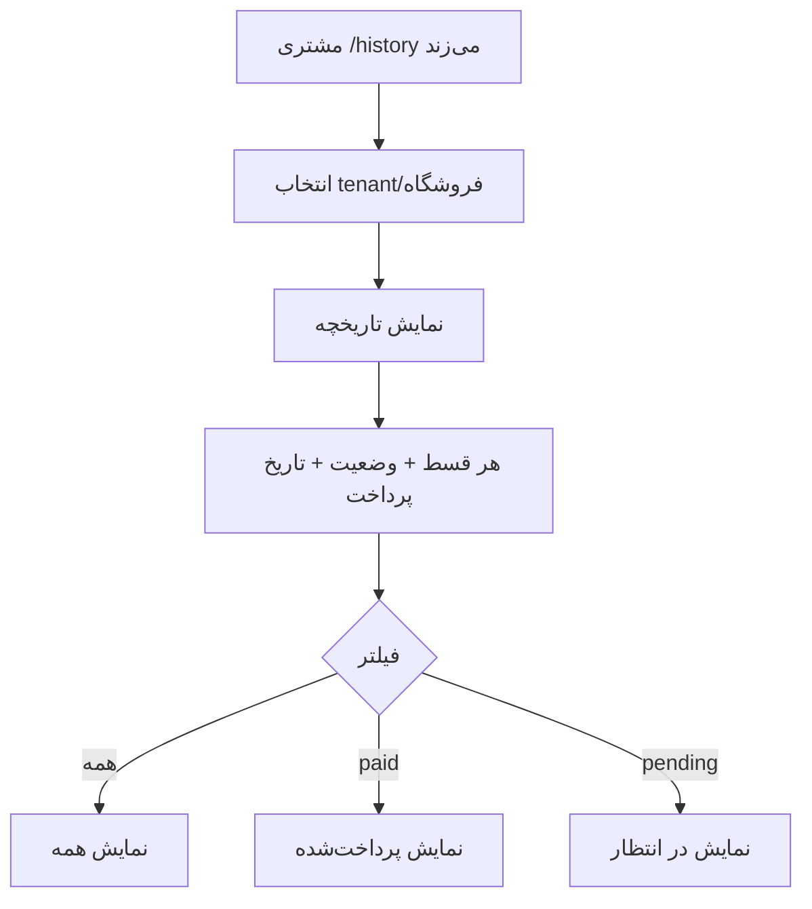
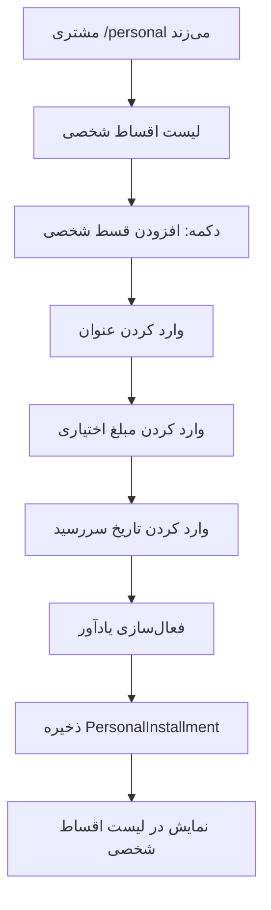

# فلوهای مشتری — ماژول اقساط
# Customer Flows — Installments Module

> **وضعیت:** Approved — v1.0  
> **نسخه:** 1.0 — 1405/04/08  
> **ADR مرتبط:** ADR-002, ADR-006, ADR-008  
> **مراجع:**
> - [BUSINESS-RULES.md](./BUSINESS-RULES.md)
> - [state-machines.md](./state-machines.md)
> - [channels-strategy.md](../../05-channels/channels-strategy.md)

---

## مقدمه

مشتری در Hivork از طریق دو کانال اصلی با سیستم تعامل دارد:

1. **ربات تلگرام / Bale** — کانال اصلی (فاز ۱)
2. **PWA (وب‌اپ پیشرفته)** — کانال ثانویه برای جزئیات بیشتر

مشتری `actor: customer` است و **هرگز** به endpoint‌های staff دسترسی ندارد.

---

## CF-001: لینک کردن ربات (Bot Onboarding)

### پیش‌شرط‌ها
- مشتری توسط فروشنده ثبت شده است (TenantCustomer وجود دارد)
- فروشنده لینک یا QR code به مشتری داده است

### مراحل



### پیام‌های ربات (نمونه)

```
✅ حساب شما با موفقیت متصل شد!

سلام [نام مشتری] عزیز،
اقساط شما در فروشگاه [نام tenant] اکنون از طریق این ربات قابل مشاهده است.

برای مشاهده اقساط: /installments
برای گزارش پرداخت: /pay
برای راهنما: /help
```

### پس‌شرط‌ها
- `BotIdentity` با `chatId` در DB ثبت شده
- یادآورهای آینده برای این مشتری فعال می‌شوند
- `CustomerLinkedToBot` event در outbox

### خطاها

| خطا | پیام به مشتری |
|-----|--------------|
| Token منقضی (۲۴h) | «لینک شما منقضی شده است. از فروشنده لینک جدید بخواهید.» |
| Token مصرف‌شده | «این لینک قبلاً استفاده شده است. با فروشنده تماس بگیرید.» |
| شماره نامطابق | «شماره تلفن تلگرام شما با اطلاعات ثبت‌شده مطابق ندارد.» |

---

## CF-002: مشاهده لیست اقساط

### پیش‌شرط‌ها
- مشتری ربات را لینک کرده است (CF-001)
- مشتری authenticated است (token معتبر)

### مراحل



### نمونه نمایش در ربات

```
📋 اقساط شما

🔴 سررسید گذشته:
1. [فروشگاه نیکو] قسط ۲ از ۴ — ۱,۵۰۰,۰۰۰ تومان — سررسید: ۱۴۰۵/۰۳/۱۵
   [💳 گزارش پرداخت]

🟡 سررسید این هفته:
2. [فروشگاه نیکو] قسط ۳ از ۴ — ۱,۵۰۰,۰۰۰ تومان — سررسید: ۱۴۰۵/۰۴/۱۵
   [💳 گزارش پرداخت]

✅ پرداخت‌شده:
3. [فروشگاه نیکو] قسط ۱ از ۴ — ۱,۵۰۰,۰۰۰ تومان — ۱۴۰۵/۰۲/۱۵
```

### قوانین نمایش
- مبالغ به **تومان** نمایش داده می‌شوند (از تنظیمات tenant)
- تاریخ‌ها به **شمسی** نمایش داده می‌شوند
- اقساط چند tenant جداگانه نمایش داده می‌شوند

---

## CF-003: گزارش پرداخت

### پیش‌شرط‌ها
- قسط در وضعیت `pending` یا `overdue` است
- هیچ `PaymentAttempt.pending` برای این قسط وجود ندارد (BR-021)

### مراحل



### نمونه مکالمه ربات

```
💳 گزارش پرداخت

قسط: ۲ از ۴
مبلغ: ۱,۵۰۰,۰۰۰ تومان
سررسید: ۱۴۰۵/۰۳/۱۵

آیا تصویر رسید دارید؟
[📎 ارسال رسید]  [بدون رسید ✓]

---
[پس از کلیک "بدون رسید"]

✅ پرداخت شما ثبت شد و در انتظار تأیید فروشنده است.

---
[پیام پس از تأیید فروشنده]

✅ پرداخت قسط ۲ تأیید شد!
فروشگاه نیکو پرداخت شما را تأیید کرد.
موجودی اقساط باقیمانده: ۲ قسط
```

### خطاها

| سناریو | پیام به مشتری |
|---------|--------------|
| قسط قبلاً پرداخت‌شده | «این قسط قبلاً پرداخت شده است.» |
| پرداخت در انتظار تأیید | «یک پرداخت در انتظار تأیید وجود دارد.» |
| قسط بخشوده‌شده | «این قسط توسط فروشنده بخشوده شده است.» |

---

## CF-004: مشاهده تاریخچه پرداخت‌ها

### مراحل



### نمونه نمایش

```
📊 تاریخچه اقساط — فروشگاه نیکو

قسط ۱/۴ — ۱,۵۰۰,۰۰۰ تومان ✅ پرداخت‌شده — ۱۴۰۵/۰۲/۱۵
قسط ۲/۴ — ۱,۵۰۰,۰۰۰ تومان ✅ پرداخت‌شده — ۱۴۰۵/۰۳/۱۸
قسط ۳/۴ — ۱,۵۰۰,۰۰۰ تومان ⏳ در انتظار — ۱۴۰۵/۰۴/۱۵
قسط ۴/۴ — ۱,۵۰۰,۰۰۰ تومان ⏳ در انتظار — ۱۴۰۵/۰۵/۱۵

جمع کل: ۶,۰۰۰,۰۰۰ تومان
پرداخت‌شده: ۳,۰۰۰,۰۰۰ تومان
باقیمانده: ۳,۰۰۰,۰۰۰ تومان
```

---

## CF-005: اقساط شخصی مشتری

مشتری می‌تواند اقساط شخصی خود (مستقل از tenant) اضافه کند.

### مراحل



### فیلدهای اقساط شخصی

| فیلد | اجباری | توضیح |
|------|--------|-------|
| عنوان | بله | مثال: «قسط خودرو» |
| مبلغ | خیر | برای نمایش |
| سررسید | بله | تاریخ شمسی |
| یادآور | خیر | پیش‌فرض فعال |
| یادداشت | خیر | توضیحات اضافه |

---

## CF-006: دریافت یادآور

مشتری یادآورهای خودکار دریافت می‌کند:

### زمان‌بندی یادآورها (از تنظیمات tenant)

| نوع یادآور | زمان پیش‌فرض |
|------------|--------------|
| `before_3d` | ۳ روز قبل از سررسید |
| `before_1d` | ۱ روز قبل از سررسید |
| `due_date` | روز سررسید |
| `overdue_1d` | ۱ روز بعد از سررسید |
| `overdue_3d` | ۳ روز بعد از سررسید |
| `overdue_7d` | ۷ روز بعد از سررسید |

### نمونه پیام یادآور

```
⏰ یادآور پرداخت قسط

فروشگاه: نیکو موبایل
قسط: ۳ از ۴
مبلغ: ۱,۵۰۰,۰۰۰ تومان
سررسید: فردا — ۱۴۰۵/۰۴/۱۵

[💳 گزارش پرداخت]  [🔕 یادآوری نکن]
```

### کانال‌های یادآور
- تلگرام (اصلی)
- Bale (فاز ۲)
- SMS (fallback)

---

## CF-007: قطع ارتباط ربات (Unlink)

### مراحل
- مشتری `/unlink` می‌زند یا از ربات block می‌کند
- BotIdentity soft-delete می‌شود
- یادآورهای آینده ارسال نمی‌شوند
- داده‌های قسط حفظ می‌شوند

---

## خلاصه فلوها

| فلو | کانال | نیاز به لینک ربات |
|-----|-------|------------------|
| CF-001: لینک ربات | Telegram | خیر |
| CF-002: مشاهده اقساط | Telegram / PWA | بله |
| CF-003: گزارش پرداخت | Telegram / PWA | بله |
| CF-004: تاریخچه | Telegram / PWA | بله |
| CF-005: اقساط شخصی | Telegram / PWA | بله |
| CF-006: یادآور | Telegram | بله |
| CF-007: قطع ارتباط | Telegram | بله |

---

*نسخه 1.0 — 1405/04/08*
