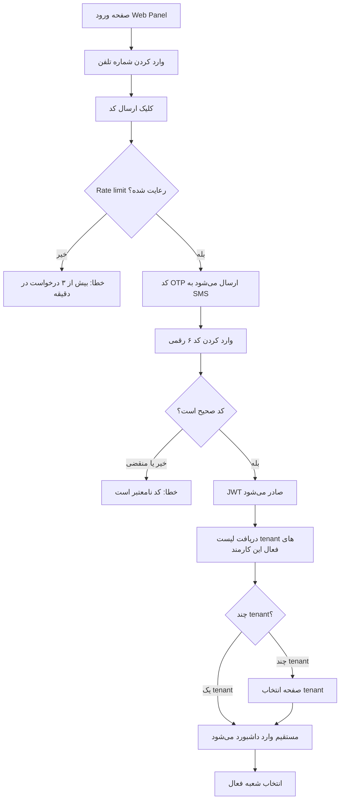
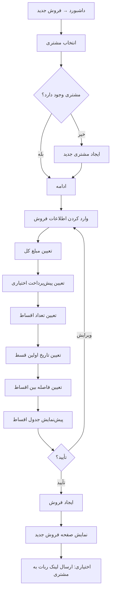
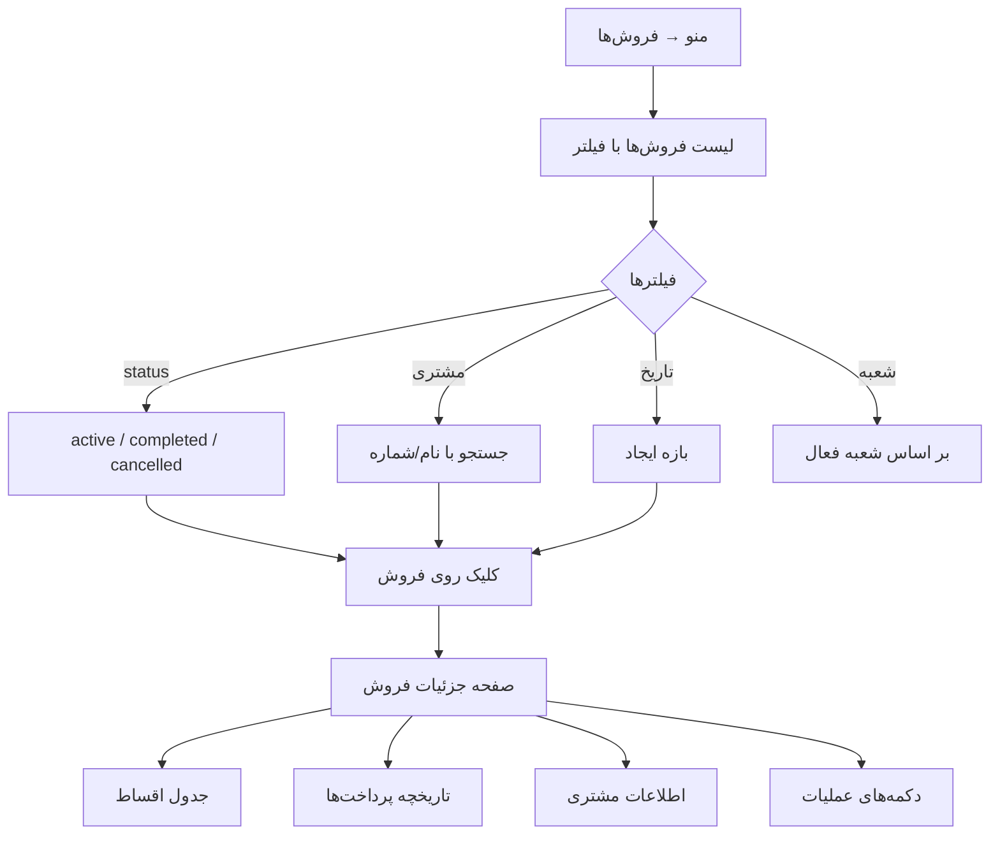
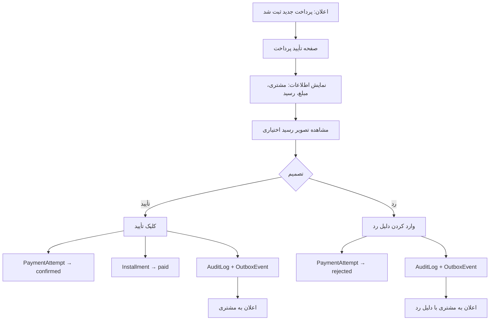
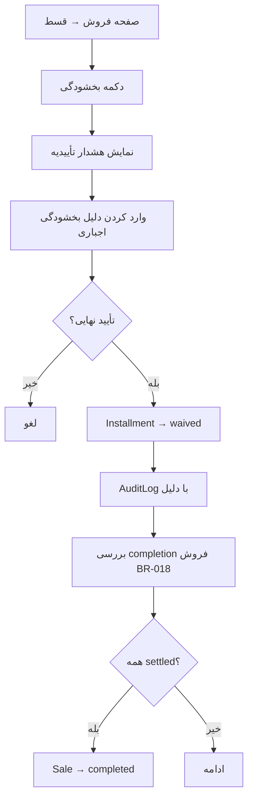
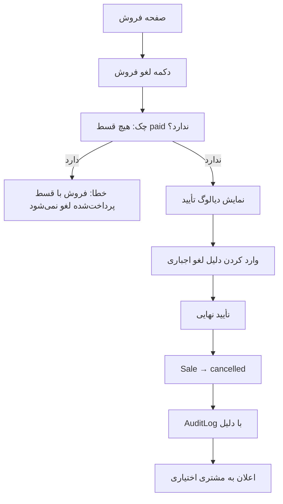
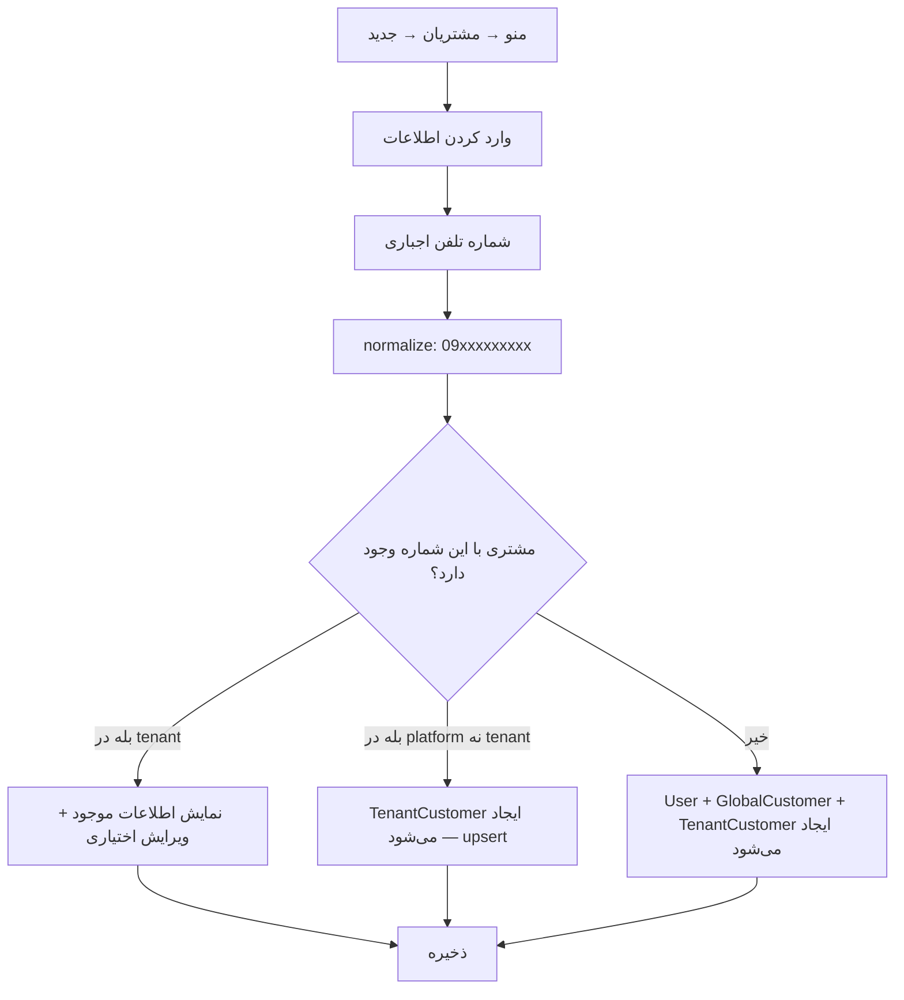
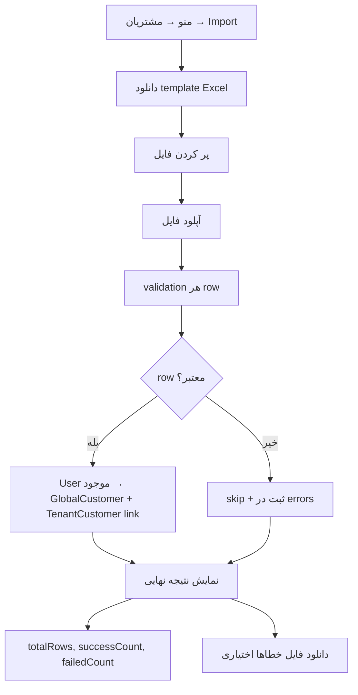
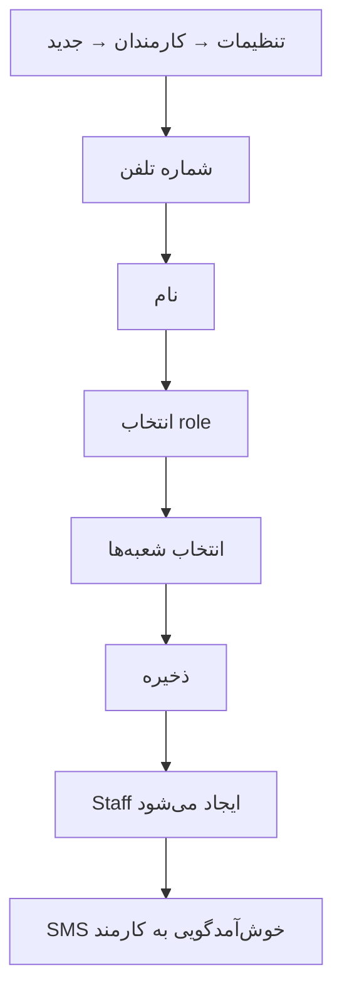
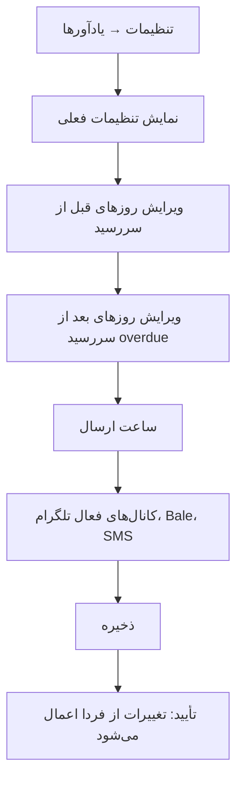

# فلوهای کارمند (Staff) — ماژول اقساط
# Staff Flows — Installments Module

> **وضعیت:** Approved — v1.0  
> **نسخه:** 1.0 — 1405/04/08  
> **ADR مرتبط:** ADR-004, ADR-008, ADR-015  
> **مراجع:**
> - [BUSINESS-RULES.md](./BUSINESS-RULES.md)
> - [RBAC](../../02-architecture/rbac.md)
> - [state-machines.md](./state-machines.md)

---

## مقدمه

کارمند (Staff) از طریق Web Panel به سیستم دسترسی دارد. هر کارمند:
- به یک tenant تعلق دارد
- یک یا چند role دارد (owner, manager, cashier, viewer)
- به یک یا چند شعبه دسترسی دارد

---

## SF-001: ورود به سیستم (OTP Login)

### پیش‌شرط‌ها
- کارمند توسط owner در سیستم ثبت شده است
- شماره تلفن در DB وجود دارد

### مراحل



### پس‌شرط‌ها
- Access token (15 دقیقه) در حافظه
- Refresh token (30 روز) در cookie httpOnly
- شعبه فعال در session

### خطاها

| خطا | کد | HTTP |
|-----|-----|------|
| Rate limit | `OTP_RATE_LIMIT` | 429 |
| کد نامعتبر / منقضی | `OTP_INVALID_OR_EXPIRED` | 400 |
| کارمند غیرفعال | `STAFF_INACTIVE` | 403 |

---

## SF-002: ایجاد فروش جدید

### پیش‌شرط‌ها
- کارمند permission `installments.sale.create` دارد
- کارمند به شعبه انتخابی دسترسی دارد
- مشتری در tenant وجود دارد

### مراحل



### فرم ایجاد فروش — فیلدها

| فیلد | نوع | اجباری | توضیح |
|------|-----|--------|-------|
| مشتری | جستجو | بله | جستجو با نام یا شماره |
| عنوان | text | خیر | شرح کالا/خدمت |
| مبلغ کل | عدد تومان | بله | تبدیل به ریال |
| پیش‌پرداخت | عدد تومان | خیر | پیش‌فرض: 0 |
| تعداد اقساط | عدد | بله | ۱ تا ۱۲۰ |
| تاریخ قسط اول | Datepicker | بله | Jalali |
| فاصله (روز) | عدد | بله | پیش‌فرض: 30 |
| یادداشت | textarea | خیر | |

### پیش‌نمایش جدول

قبل از ثبت نهایی، جدول کامل اقساط نمایش داده می‌شود:

```
قسط ۱ — ۱,۵۰۰,۰۰۰ تومان — ۱۴۰۵/۰۵/۰۱
قسط ۲ — ۱,۵۰۰,۰۰۰ تومان — ۱۴۰۵/۰۶/۰۱
قسط ۳ — ۱,۵۰۰,۰۰۰ تومان — ۱۴۰۵/۰۷/۰۱
قسط ۴ — ۱,۵۰۰,۰۰۰ تومان — ۱۴۰۵/۰۸/۰۱
─────────────────────────────────
جمع: ۶,۰۰۰,۰۰۰ تومان
پیش‌پرداخت: ۰
کل فروش: ۶,۰۰۰,۰۰۰ تومان ✓
```

### پس‌شرط‌ها
- Sale با status `active` در DB
- N تا Installment با status `pending`
- AuditLog (`sale.create`)
- OutboxEvent (`SaleCreated`)

---

## SF-003: مشاهده و مدیریت فروش‌ها

### مراحل



### فیلترها و مرتب‌سازی

| فیلتر | نوع | توضیح |
|-------|-----|-------|
| وضعیت | multi-select | active, completed, cancelled |
| مشتری | text search | نام یا شماره |
| بازه تاریخ | date range | Jalali |
| شعبه | dropdown | بر اساس دسترسی کارمند |
| مبلغ | range | حداقل/حداکثر |

### صفحه جزئیات فروش

```
─────────────────────────────────────────
فروش #SALE-1234 — فروشگاه نیکو
─────────────────────────────────────────
مشتری: علی محمدی | ۰۹۱۲****۵۶۷
شعبه: شعبه مرکزی
وضعیت: فعال 🟢
ایجاد: ۱۴۰۵/۰۱/۱۵ توسط رضا کاشانی

کل مبلغ: ۶,۰۰۰,۰۰۰ تومان
پیش‌پرداخت: ۰

─────────────────────────────────────────
اقساط:
قسط ۱ ✅ ۱,۵۰۰,۰۰۰ — ۱۴۰۵/۰۲/۱۵ (پرداخت‌شده)
قسط ۲ ✅ ۱,۵۰۰,۰۰۰ — ۱۴۰۵/۰۳/۱۵ (پرداخت‌شده)
قسط ۳ 🔴 ۱,۵۰۰,۰۰۰ — ۱۴۰۵/۰۴/۱۵ (سررسید گذشته)
قسط ۴ ⏳ ۱,۵۰۰,۰۰۰ — ۱۴۰۵/۰۵/۱۵ (در انتظار)

[لغو فروش]  [ارسال مجدد لینک ربات]
```

---

## SF-004: تأیید پرداخت

### پیش‌شرط‌ها
- کارمند permission `installments.payment.confirm` دارد
- `PaymentAttempt` با status `pending` وجود دارد

### مراحل



### صفحه تأیید پرداخت

```
─────────────────────────────────────────
تأیید پرداخت — قسط ۳ از ۴
─────────────────────────────────────────
مشتری: علی محمدی
فروش: #SALE-1234 — گوشی موبایل
مبلغ قسط: ۱,۵۰۰,۰۰۰ تومان

گزارش مشتری در:
  مبلغ گزارش‌شده: ۱,۵۰۰,۰۰۰ تومان
  یادداشت: «واریز کردم به حساب شما»
  رسید: [مشاهده تصویر]

[✅ تأیید پرداخت]  [❌ رد پرداخت]
```

### خطاها

| خطا | کد |
|-----|-----|
| پرداخت قبلاً تأیید شده | `PAYMENT_ALREADY_CONFIRMED` |
| پرداخت قبلاً رد شده | `PAYMENT_ALREADY_REJECTED` |
| قسط قبلاً paid | `INSTALLMENT_ALREADY_PAID` |

---

## SF-005: بخشودگی قسط (Waive)

### پیش‌شرط‌ها
- کارمند permission `installments.installment.waive` دارد
- قسط در وضعیت `pending` یا `overdue` است

### مراحل



### خطاها

| خطا | کد |
|-----|-----|
| قسط paid | `INSTALLMENT_ALREADY_PAID` |
| قسط waived | `INSTALLMENT_ALREADY_WAIVED` |
| permission ندارد | `PERMISSION_DENIED` |

---

## SF-006: لغو فروش

### پیش‌شرط‌ها
- کارمند permission `installments.sale.cancel` دارد
- فروش `active` است
- هیچ قسط `paid` وجود ندارد (BR-012)

### مراحل



---

## SF-007: مدیریت مشتریان

### ۷.۱ ثبت مشتری جدید



### فیلدهای مشتری

| فیلد | اجباری | توضیح |
|------|--------|-------|
| شماره تلفن | بله | normalize به 09xxxxxxxxx |
| نام | بله | حداقل ۲ حرف |
| کد محلی | خیر | کد داخلی tenant |
| یادداشت | خیر | |

### ۷.۲ Import Excel



---

## SF-008: مدیریت کارمندان (owner only)

### پیش‌شرط‌ها
- کارمند role `owner` یا permission `core.staff.create` دارد

### مراحل افزودن کارمند



---

## SF-009: تنظیمات یادآور

### پیش‌شرط‌ها
- کارمند permission `installments.reminder.configure` دارد

### مراحل



### فیلدهای تنظیمات

| فیلد | نوع | پیش‌فرض |
|------|-----|---------|
| روزهای قبل از سررسید | multi-select | [3, 1] |
| ارسال در روز سررسید | toggle | true |
| روزهای بعد از سررسید | multi-select | [1, 3, 7] |
| ساعت ارسال | time picker | 09:00 تهران |
| کانال‌ها | multi-select | [telegram] |

---

## SF-010: گزارش‌ها و داشبورد

### داشبورد

```
─────────────────────────────────────────
داشبورد — فروشگاه نیکو — شعبه مرکزی
─────────────────────────────────────────
امروز: ۱۴۰۵/۰۴/۰۸

[کارت] قسط‌های سررسید امروز: ۱۲
[کارت] معوق: ۸
[کارت] دریافتی این ماه: ۴۵,۰۰۰,۰۰۰ تومان
[کارت] فروش‌های فعال: ۴۷

[جدول] قسط‌های سررسید امروز
[نمودار] دریافتی هفته گذشته
```

### دسترسی هر role به گزارش‌ها

| گزارش | owner | manager | cashier | viewer |
|-------|:-----:|:-------:|:-------:|:------:|
| داشبورد | ✅ | ✅ | ✅ | ✅ |
| لیست معوق | ✅ | ✅ | ✅ | ✅ |
| گزارش مالی | ✅ | ✅ | ❌ | ✅ |
| Export Excel | ✅ | ✅ | ❌ | ✅ |

---

## خلاصه فلوها — دسترسی

| فلو | owner | manager | cashier | viewer |
|-----|:-----:|:-------:|:-------:|:------:|
| SF-001: ورود | ✅ | ✅ | ✅ | ✅ |
| SF-002: ایجاد فروش | ✅ | ✅ | ✅ | ❌ |
| SF-003: مشاهده فروش | ✅ | ✅ | ✅ | ✅ |
| SF-004: تأیید پرداخت | ✅ | ✅ | ✅ | ❌ |
| SF-005: بخشودگی | ✅ | ✅ | ❌ | ❌ |
| SF-006: لغو فروش | ✅ | ✅ | ❌ | ❌ |
| SF-007: مدیریت مشتری | ✅ | ✅ | ❌ | ❌ |
| SF-008: مدیریت کارمند | ✅ | ❌ | ❌ | ❌ |
| SF-009: تنظیمات یادآور | ✅ | ✅ | ❌ | ❌ |
| SF-010: گزارش‌ها | ✅ | ✅ | ✅* | ✅ |

*cashier گزارش‌های محدود (برای شعبه خود)

---

*نسخه 1.0 — 1405/04/08*
