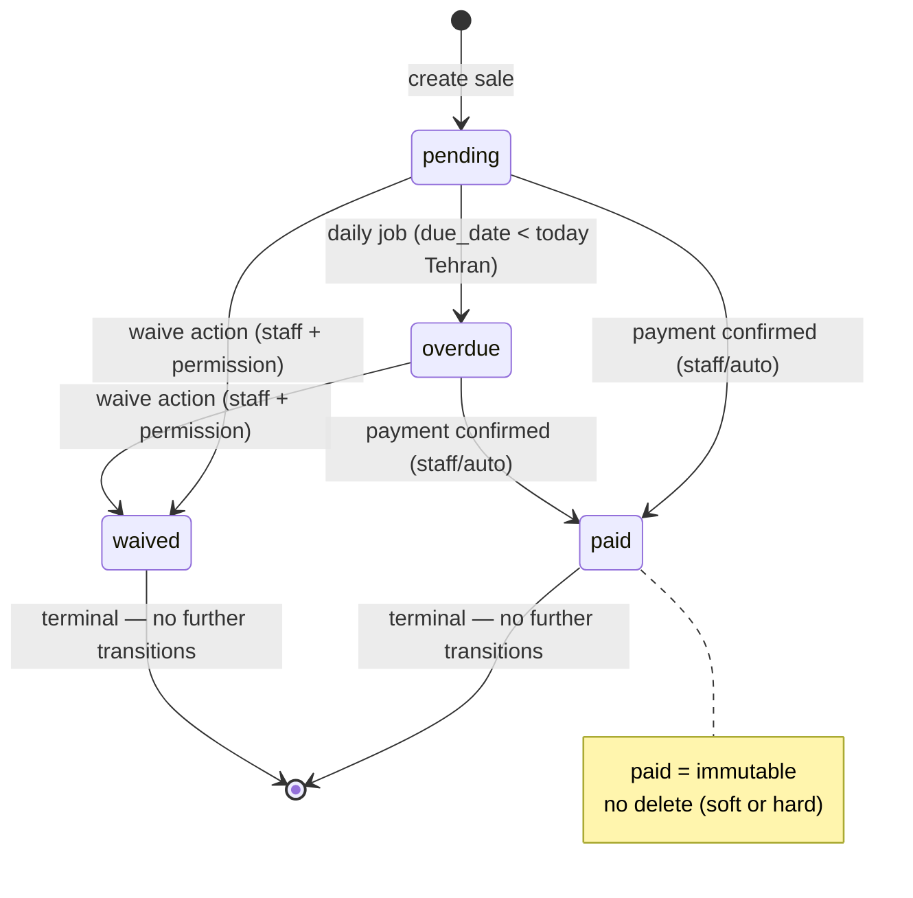
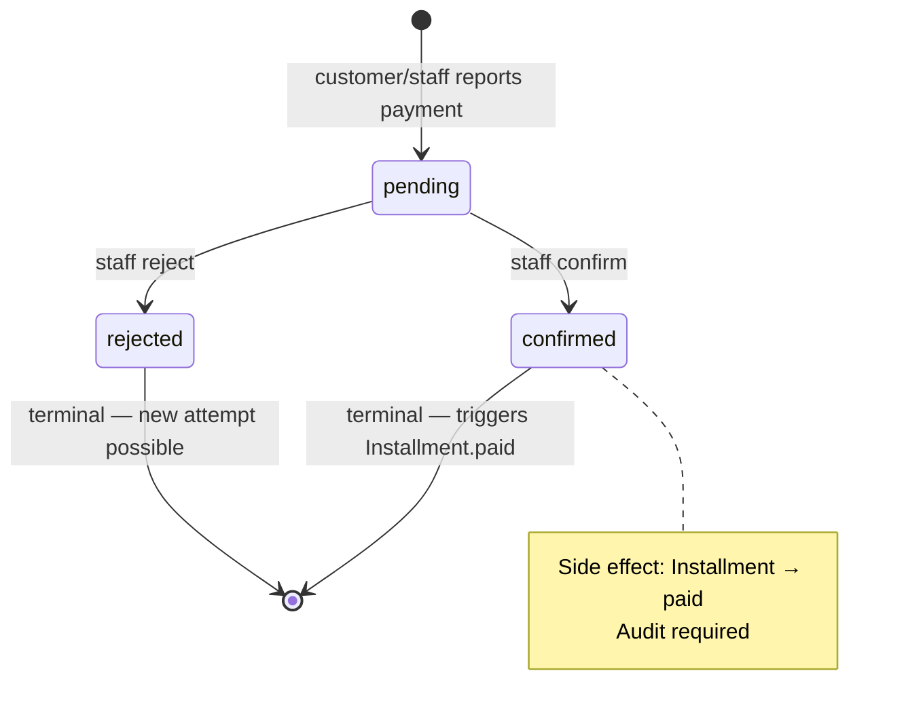
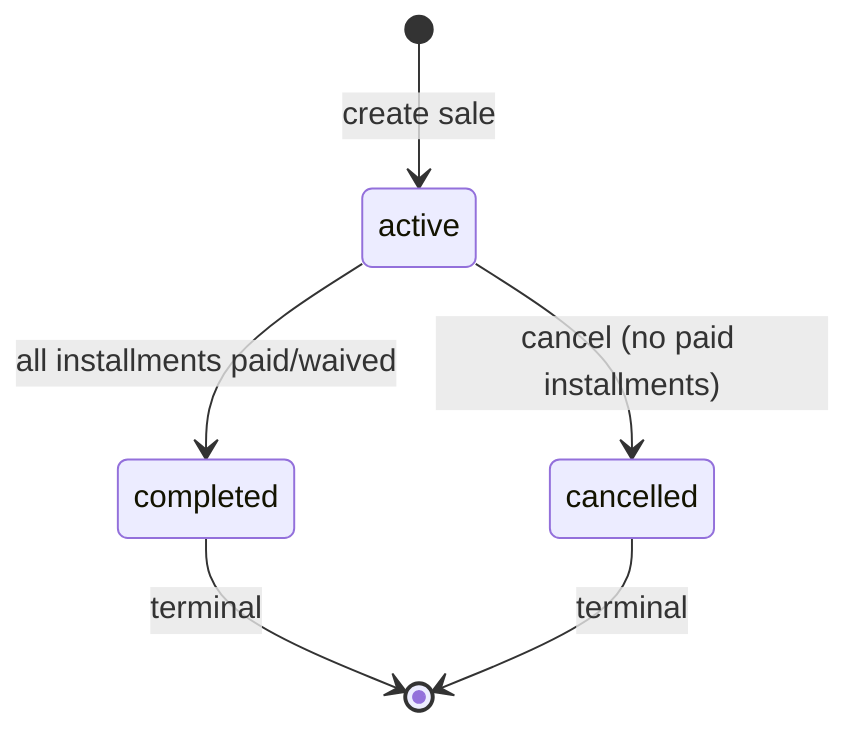

# State Machines — ماژول اقساط

> **ADR مرتبط:** ADR-008, ADR-013  
> **قانون:** Transition فقط در domain entity method — نه در use case یا controller

---

## Installment Status



```
                    ┌─────────────┐
                    │   pending   │◄── create sale
                    └──────┬──────┘
                           │
           ┌───────────────┼───────────────┐
           │ due_date passed              │
           ▼                               │
    ┌─────────────┐                         │
    │   overdue   │─────────────────────────┤
    └──────┬──────┘                         │
           │                               │
           │ payment confirmed             │ waive (staff)
           ▼                               ▼
    ┌─────────────┐                 ┌─────────────┐
    │    paid     │                 │   waived    │
    └─────────────┘                 └─────────────┘
           ▲
           │ payment confirmed (from pending)
           └──────────────────────────────
```

### Transition Rules

| From | To | Trigger | Actor |
|------|-----|---------|-------|
| `pending` | `overdue` | daily job / due_date passed | system |
| `pending` | `paid` | payment confirmed | staff / auto |
| `overdue` | `paid` | payment confirmed | staff / auto |
| `pending` | `waived` | waive action | staff + permission |
| `overdue` | `waived` | waive action | staff + permission |
| `paid` | * | — | **ممنوع** |
| `waived` | * | — | **ممنوع** |

---

## PaymentAttempt Status



```
    ┌─────────────┐
    │   pending   │◄── customer/staff reports payment
    └──────┬──────┘
           │
     ┌─────┴─────┐
     ▼           ▼
┌─────────┐ ┌─────────┐
│confirmed│ │rejected │
└────┬────┘ └─────────┘
     │
     └──► triggers Installment → paid
```

### Transition Rules

| From | To | Trigger | Side Effect |
|------|-----|---------|-------------|
| `pending` | `confirmed` | staff confirm | installment → paid |
| `pending` | `rejected` | staff reject | notify customer |
| `confirmed` | * | — | **ممنوع** |
| `rejected` | `pending` | — | **ممنوع** (new attempt instead) |

### Auto-Confirm (Setting)

```
IF require_seller_payment_confirmation == false
  AND reported_by_type == staff
  → auto confirm
```

Customer report: **همیشه** pending تا confirm (default setting).

---

## Sale Status



```
    ┌─────────────┐
    │   active    │◄── create
    └──────┬──────┘
           │
     ┌─────┴─────┐
     ▼           ▼
┌───────────┐ ┌───────────┐
│ completed │ │ cancelled │
└───────────┘ └───────────┘
```

| From | To | Trigger |
|------|-----|---------|
| `active` | `completed` | all installments paid/waived |
| `active` | `cancelled` | cancel (no paid installments) |
| `completed` | * | ممنوع |
| `cancelled` | * | ممنوع |

---

## PersonalInstallment Status

```
pending ──► paid
```

ساده — بدون overdue escalation در فاز ۱ (optional فاز ۲).

---

## Bot Link Token

```
    ┌─────────────┐
    │   issued    │◄── staff generates / sale created
    └──────┬──────┘
           │ customer /start link_TOKEN
           ▼
    ┌─────────────┐
    │   consumed  │
    └─────────────┘
           │
           │ expires (24h default)
           ▼
    ┌─────────────┐
    │   expired   │
    └─────────────┘
```

---

## Notification Log (Immutable)

```
scheduled → sent → (failed → retry → sent | dead)
```

Unique constraint جلوگیری از duplicate send.
